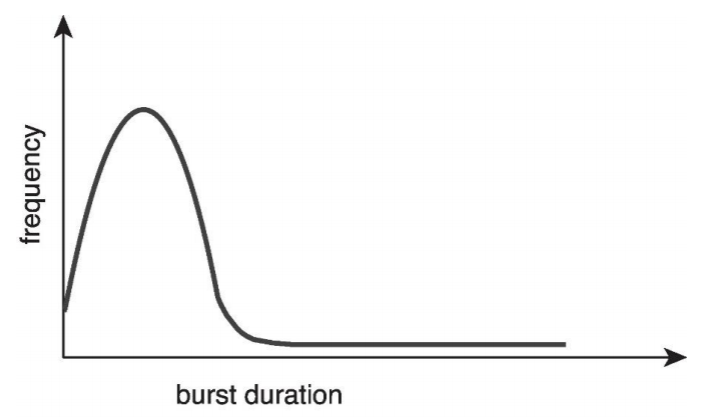
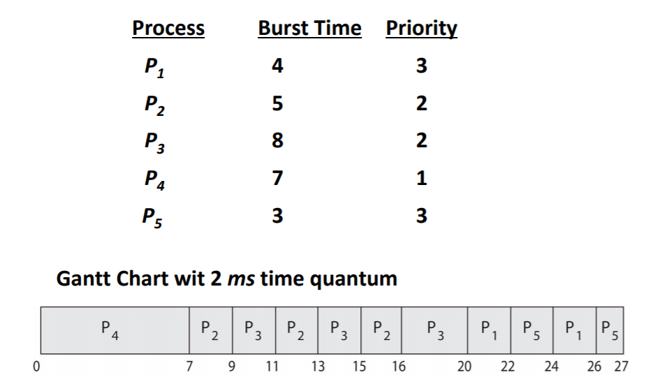

# CPU Scheduling

## CPU I/O Burst Cycle

+ CPU - I/O Burst Cycle -- process execution consist of a cycle of CPU execution and I/O wait
+ CPU burst distribution -- usually a large # of short CPU bursts and a small # of long CPU bursts
+ I/O bound: many short CPU bursts, few long I/O bursts
+ CPU -bound: have a hew long CPU bursts

> 
>
> Usually, a process consists of a large number of short CPU bursts and a small number of long CPU bursts

## Process Scheduling

+ Term Definition
  + **Process scheduler**(or **CPU scheduler**): selects from among the processes that are ready to execute, i.e., in the ready queue 
    (Timer 會定時使 CPU 在 process 與 OS 間做切換，好讓 OS 來做排程)
  + **Degree of multiprogramming**: the number of processes currently in memory
+ Process scheduler should meet following objectives
  + Objective of multi-programming
  + Objective of timesharing

## Scheduling Criteria

TODO

## Preemptive and Nonpreemptive Scheduling

CPU scheduling decisions may take place when a process:

1. Switches from running to waiting state
   + **system call() **e.g. preform **I/O 開始執行** or invoke wait() 
2. Switches from running to ready state
   + **interrupt (計時器)**
3. Switches form waiting to ready state
   1. **I/O 執行結束** or **event completion**
4. Terminate
   + **system call() exit**

### Nonpreemptive or cooperative scheduling (不搶)

1. When scheduling takes place only under 1 and 4
2. Process keeps the CPU until it releases the CPU
3. Bad for time-sharing system and real-time systems

### Preemptive scheduling (會搶)

1. Scheduling takes place under all the circumstances(1 to 4)
2. A process having obtained CPU may be forced to release CPU
3. A cost associated with shared data access

## Dispatcher

dispatcher: gives a CPU core to the process selected by the CPU schedular

This involves:

+ switching context from one process to another process
+ Switching to user mode
+ Jumping to the proper location in the user program to resume that program

**Dispatch latency** - time it takes for the dispatcher to stop one process and start another running

## Scheduling Algorithm

### Scheduling Criteria

**used to judge the performance of a scheduling algorithm**

+ CPU utilization

+ Throughput

+ Turnaround time

  > Amount of time to execute a particular process
  >
  > **From process submission to process termination**

+ Waiting time

  > Amount of time a process has been waiting in the ready queue

+ Response time

  > Amount of time it takes from when a request was submitted until the response is produced

### First-Come, First-Served (FCFS) Scheduling

照來的順序，但有個缺點，執行越久的先執行那後面要等很久，最好是比較快的來先做比較快的

FCFS is non-preemptive

### Shortest-Job-First (SJF) Scheduling

> The smallest next CPU burst length is selected

+ SJF is optimal

+ But, how to implement?

  > 我們無法得知 CPU burst time
  >
  > 因此我們只能藉由歷史記錄來推測

#### Predict Length of Next CPU Burst

> Using the length of previous CPU bursts, using exponential averaging
>
> 1. $t_n$ = actual length of $n^{th}$ CPU burst
> 2. $\tau_{n+1}$ = predicted value of the next CPU burst
> 3. $\alpha, 0\le\alpha\le1$
> 4. Define: $\tau_{n+1}=\alpha t_n+(1-\alpha)\tau_n$
>
> $\alpha$ 怎麼決定？越接近現在越大 (近期的影響比歷史重要)

### Round Robin (RR)

windows 和 linux 傾向使用 round robin

Each process gets a small unit of CPU time

+ called the quantum of time slice (10-100 ms)
+ After this time has elapsed, the process is **preempted** and added to the tail of red

> First-come, first served (non-preempted)
>
> Round robin (preempted)

If there are **n** process and the time quantum is **q**, each process gets **1/n** of the CPU time in chunks of at most q time unit as once.

Typically, higher average turnaround time than SJF, but better response.

Performance

+ $q$ large: FIFO
+ $q$ small: q must be large with respect to context switch

Rule of thumb: 80% of CPU bursts should be shorter than the time quantum

### Priority Scheduling

A priority number is associated with each process

The CPU is allocated to the process with the highest priority (Preemptive or nonpreemptive)

Problem: starvation or indefinite blocking (權重太低永遠無法被執行)

Solution: Aging (隨著等待時間越長，增加其權重)

### Multilevel Queue Scheduling

Question: if two or more processes have the same priority?

Solution: combine RR with priority scheduling with the highest priority.

Multilevel queue scheduling can also be used when processes are easily classified into different types - e.g. foreground (interactive) and background (batch)

foreground: RR

background: FCFS (背景不需考慮 response time, 考慮到 RR 很花 context switch 的情況下，才採用 RR)

### Multilevel Feedback Queue

A process can move between various queues

idea: separate processes according to he characteristics of BPU burst

e.g.

Three queues:

+ Q0 - RR with time quantum 8 ms
+ Q1- RR with quantum 16 ms
+ Q2 - FCFS

Scheduling

> A new job enters queue Q0 which is reserved RR. When it gains CPU, job receives 8ms. If it does not finish in 8ms, job is moved to ail of queue Q1
>
> If Q0 is empty, Q1 is served by RR and receives 16 additional ms. If it still does not complete, it is preempted and moved to queue Q2.

## Thread Scheduling

