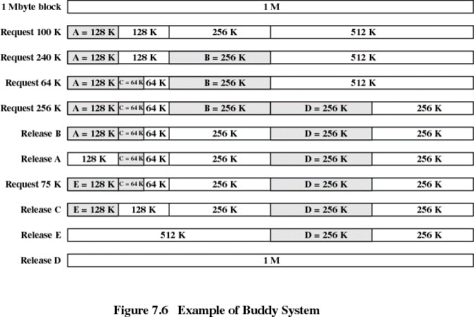

# Chapter 10: virtual memory

[TOC]

**Motivation** :bulb:

In many cases, entire program is not needed. Even when the entire program is needed, it may not all be needed at the same time.

Idea: execute partially-loaded program

Solution: virtual memory.

**Benefits** :thumbsup:

1. Program no longer constrained by sized of physical memory
2. Less memory is needed and more processes in memory
3. Less I/O needed and faster response

## Implement

### Demand paging :page_with_curl:

Bring a page from disk into memory only when it is needed.

1. **Swapper:** manipulate entire processes (搬整個程式，比如說把整本OS課本搬到書桌上), seldom used today.
2. **Pager (or Lazy Swapper):** manipulate the individual pages of a process.


*Where to put the pages that are paged out?* :man_shrugging:

Put them to a partition on the secondary memory

### Free-frame list

Free-frame list is used upon a page faults, or upon a stack or heap expand.

Free-frame lists are zero-fill-on-demand. 當OS要 allocate 記憶體時會先將需要的部分都清為零，再從硬碟載入，避免記憶體的殘值被其他program知道

### Hardware support for demand paging

How do we know if a page is in memory or not? **Valid-Invalid bit need hardware support**. 

During address translation by MMU, if valid-invalid bit is 0 → CPU signals page-fault trap to OS.

為什麼要以硬體實作：因為這是 MMU 要看的，且 Page table 的格式由硬體去設計


**But the valid-invalid bit is set by OS**

1. CPU 需要透過 MMU 取得實際位置
2. MMU 查 page table 發現是 invalid bit
3. MMU 發送 trap 給 OS
4. OS 前往硬碟搬送資料回 Physical memory
5. OS 重設 page table 的 valid-invalid bit
6. CPU 取得資料

## Performance

Demand paging can significantly affect the performance of a computer system.

實際上 page fault rate 非常小，因為程式具有 Locality，所以不太影響效能

**Locality**

+ Temporal locality (時間區域性)

  A data/instruction which is recently accessed/executed have high chances of access/execution again. (一筆資料在最近時間內比較容易被存取)

+ Spatial locality (空間區域性)

  All those data/instructions which are stored nearby to the recently accessed/executed data/instruction have high changes of access/execution. (存取下一筆資料時與前一筆資料的位置通常相差不遠)

## Copy on write

當某程式執行 fork() 時，必需將原本的資料複製一份，但如果程式隨即呼叫 exec() 時，又把原本複製的資料蓋過去，等於說原先的複製是脫褲子放屁。

乾脆一開始 fork() 時就不要複製，而是將虛擬記憶體也指向原先的程父程式(僅讀取)。等到真的要 exec() 時再 allocate 其他記憶體 (不影響原先程式)。

How to implement copy-on-write? use copy-on-write bit in page table. copy-on-write bit means "writable".

0: 不可寫 1: 可寫

1. CPU 執行時需要「寫入」時
2. MMU 發現 copy-on-write bit 是 0 限讀 (需要做copy才能改)
3. MMU 發送 trap 給 OS (請求OS做Copy)
4. OS 將該資料再複製一分

## Page replacement

How to do if physical memory is full?

1. page out victim page
2. change to invalid
3. page in desired page
4. reset page table for new page

問題：太慢，解法是利用 modify bit (or dirty bit). **Only modified pages are written to disk**

Page-replacement algorithm (要選哪一個剔掉最好？)

### FIFO page replacement

缺點：有可能記憶體越大 Page fault 次數反而上升。稱為 *Belady's anomaly*

### Optimal algorithm

如果能預見未來，在 page replacement 時優先犧牲近期不會用到的 frame，但是這個方法很難實作，畢竟這需要預見未來

### LRU algorithm

Least Recently Used algorithm, Replace the page that *has not been used for the longest period of time*

LRU 會優先犧牲離自己當下最久沒被用到的 frame，是以 **時間** 來做判斷，而且 LRU 沒有 Belady's anomaly 的問題

**implement by counter (time-to-use field)**

> 透過 time-of-use bit 記錄 frame 上次被使用的時間
>
> 當有 memory replace 發生時，search 最久沒被使用的

+ 每次存取記憶體時都要更動 bit
+ counter有可能會overflow
+ 沒有硬體支援

**implement by LRU stack**

較久之前使用的放底部，最近使用的放頂部，如此一來，在 replacement 發生時不需要做 linear search。

### LRU-approximation algorithm

LRU 需要充足的硬體資源，很少有系統能達到，幸運的事大多數的系統有提供 reference bit，可以透過使用 reference bit 達到 LRU 效果

#### Additional-reference-bits algorithm

reference bit 預設為 0，最近存取的會設 1，但只有 1 個bit 還不夠，所以通常會有好幾個 reference bits 做參考

Keep several history bits for each page in a table in memory. Periodically, shift the reference bit to the MSB  (discarding the LSB)


#### Second-chance (Clock) page-replacement algorithm

FIFO + reference bit

Use FIFO selection of pages for replacement. If selected page has reference bit = 0 (少用到), replace the page. If selected page has reference bit = 1 (較常用), then give it a second change (clear reference bit to 0)


#### Enhanced second chance algorithm

> 使用 reference bit + modified bit (aka dirty bit) 一起做決策

The pair (reference bit, modify bit), categorized into 4 classes

1. (0, 0) neither used nor dirty - best page to replace
2. (0, 1) not used but dirty - 需寫回硬碟
3. (1, 0) used but clean - probably will be used again soon
4. (1, 1) used and dirty

### Counting-based page replacement algorithm

> Keep a counter of the number of references that have been made to each page

+ 當程式開頭始用 for 迴圈時，比如

  ```c
  for(i=0; i<1000; i++)
  ```

  則當程式執行到 100 行時 i 的 counter 仍然很高，counting-based 明顯與程式的特性不合

### Page buffering algorithm

Several buffering mechanism to reduce the page faults overhead - keep a pool of free frames

+ Obtain a free frame from the pool before the victim is written out
+ Allows the process to restart as soon as possible

原先做法：將 victim page 搬回硬碟中，再將欲搬入之 page 搬至記憶體

page buffer: 將欲搬入之 page 搬入至 free frame 中，再將 victim page 搬回 (如此一來在搬入硬碟的 page 時就不用等待 victim page 搬回硬碟)


Remember which page was in free frame. The old page can be reused from the free-frame pool

## Allocation of Frames

Each process need a number of frames. The **minimum** number of frames per process is defined by the computer architecture. 至少有兩個一個是存指令，一個存資料.

reference: [https://gateoverflow.in/1018/gate-cse-2004-question-21-isro2007-44](https://gateoverflow.in/1018/gate-cse-2004-question-21-isro2007-44)

The **maximum** number of frames per process is defined by the amount of available physical memory.

**allocation algorithm**

How to allocate the free memory among the various processes?

+ equal allocation: if 100 frames and 5 processes, give each 20 frames
+ proportional allocation: depends on size, or depends on both size and priority

**Global v.s. Local allocation**

+ Global replacement: selects a replacement frame from the set of **all frames**
  + One process can take a frame from another
  + A process cannot control its own page fault rate
+ Local replacement: each process selects a replacement frame from its **own frames**
  + Bad: seldom used frames of the other processes cannot be used by the process

Global replacement is more common (效能較好)

## Thrashing

當給予的 frame 太少時，page fault rate 會提高，CPU 使用率下降 (因為都在等待 page in, page out), OS 發現 CPU 使用率下降時，又會想把 CPU 榨乾

為了避免 Thrashing 發生，可以透過程式 locality 的特性來避免

### Working-set model

使用 Working-set model, working-set model 實作方法類似 additional reference bit

working set 定義為在一個特定的時間段內一個 process 所需要的內存。

The **working set model** states that a process can be in [RAM](https://en.wikipedia.org/wiki/Random-access_memory) if and only if all of the pages that it is currently using (often approximated by the most recently used pages) can be in RAM.

When the working set is a small percentage of the system's total number of pages, virtual memory systems work most efficiently and an insignificant amount of computing is spent resolving page faults. As the working set grows, resolving page faults remains manageable until the growth reaches a critical point. Then faults go up dramatically and the time spent resolving them overwhelms time spent on the computing the program was written to do. This condition is referred to as thrashing.

reference:

+ [Thrashing](https://en.wikipedia.org/wiki/Thrashing_(computer_science))
+ [Working set](https://en.wikipedia.org/wiki/Working_set)

### page-fault frequency scheme

1. measures and controls the page-fault rate to prevent thrashing
2. Set upper and lower bounds on the desired page-fault rate
3. If page fault rate exceeds the upper limit, allocate the process more frame
4. If page fault rate falls below the lower limit

## Memory Compression

在行動裝置上用的比較頻繁，因為行動裝置用的快閃記憶體不能一直寫

Reduce memory usage without resorting to page out pages.

In a virtual memory compression system, pages to be paged out of virtual memory are compressed and stored in RAM

## Allocation Kernel Memory

Treated differently from user program allocating memory

+ user application requests additional memory

  + calls `malloc()`
  + **internal fragmentation** since allocated in unit of pages
    

+ kernel requests additional memory
  kernel often allocated from **another free-memory pool**

  Why?

  1. Kernel requests memory for **data structure**, usually less than a page. Especially, **some kernel's code and data cannot be paged out.**
  2. Some kernel memory needs memory to be physically contiguous because certain hardware devices interact with physical memory

Two strategies for managing free memory that is assigned to **kernel** processes: *buddy system* and *slab allocation*

### Managing free memory for kernel processes

#### Buddy system

Allocate memory from a fixed-size(power-of-2) segment which is consist of physically-contiguous pages.

Adjacent buddies can be combined to a larger segments.



pros: easy to implement, fast to allocate and de-allocating memory

cons: internal fragmentation

reference: [Operating System | Buddy System – Memory allocation technique](https://tutorialspoint.dev/computer-science/operating-systems/operating-system-buddy-system-memory-allocation-technique#:~:text=The%20buddy%20system%20is%20a,size%20of%20S%20is%20required.&text=Else%3A%20Recursively%20divide%20the%20block,and%20get%20out%20the%20loop.)

#### Slab allocation

Compared to earlier mechanisms, it **reduces fragmentation caused by allocations and deallocations**. The technique is used to retain allocated memory that contains a data object of a certain type for reuse upon subsequent allocations of objects of the same type.

**slab**

+ One or more contiguous pages
+ Assigned to one particular cache
+ The slab is the actual container of data associated with objects of the specific kind of the containing cache

**Cache**

+ Consists of one or more slabs
+ Cache represents a small amount of very fast memory. A cache is a storage for a specific type of object, such as semaphores, process descriptors, file objects, etc.

OS 預先從實體記憶體切一塊給 slab，再把 slab 組成 cache，kernel objects 需要時就從 cache 中取用

**Example**

If a process control block (PCB) = 2KB, a cache consists of 12KB slab can store 6PCB

**Benefits**

1. No fragmentation, each unique kernel data structure has an associated cache
2. Fast memory request satisfaction. 
   + Objects in slab are created in advance and can be quickly allocated
   + Objects are releases by marking free and return to the cache
   + attractive when objects are frequently allocated and de-allocated


 ## Other Considerations

### Prepaging

To reduce the large number of page faults that occurs at process startup, prepage all or some for the pages a process will need, before they are referenced. 

+ But if prepaged pages are unused, I/O & memory was wasted.
+ Prepaging an executable program may be difficult because unclear exactly what pages should be brought in.
+ Prepaging a file may be more predictable because files are often access sequentially

### Page Size

How do we select a page size?

### I/O Interlock

### TLB search

SKIP.
