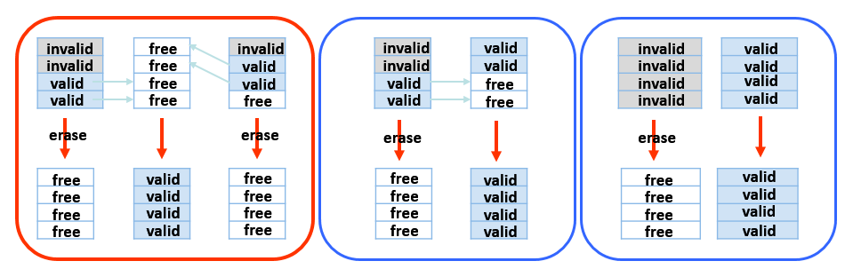
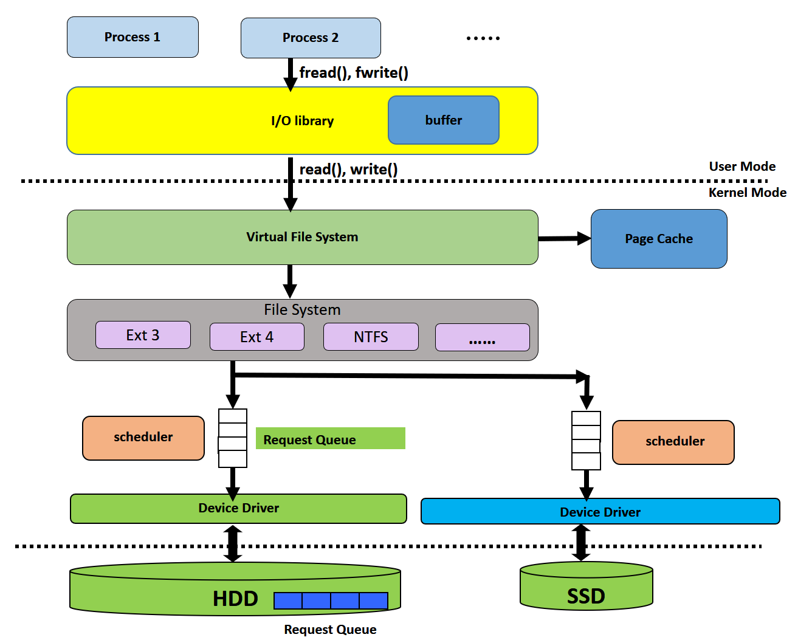
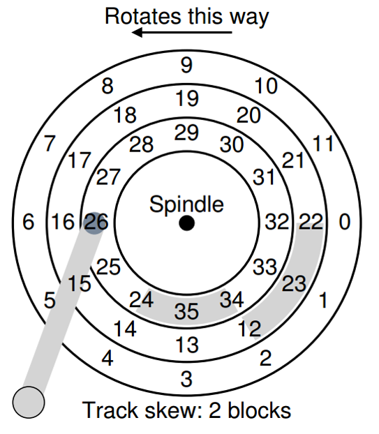
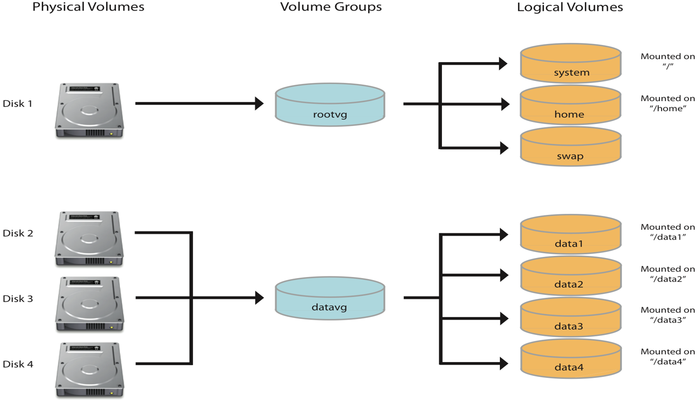
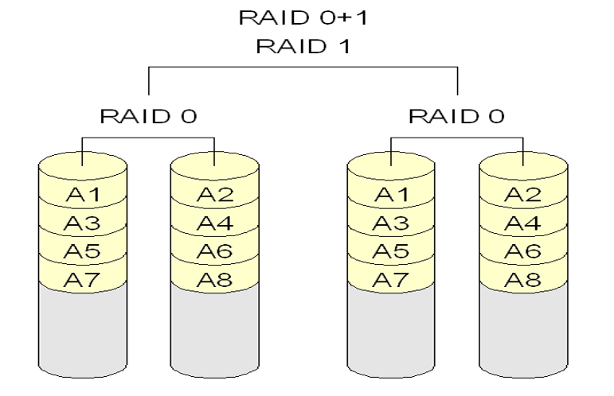
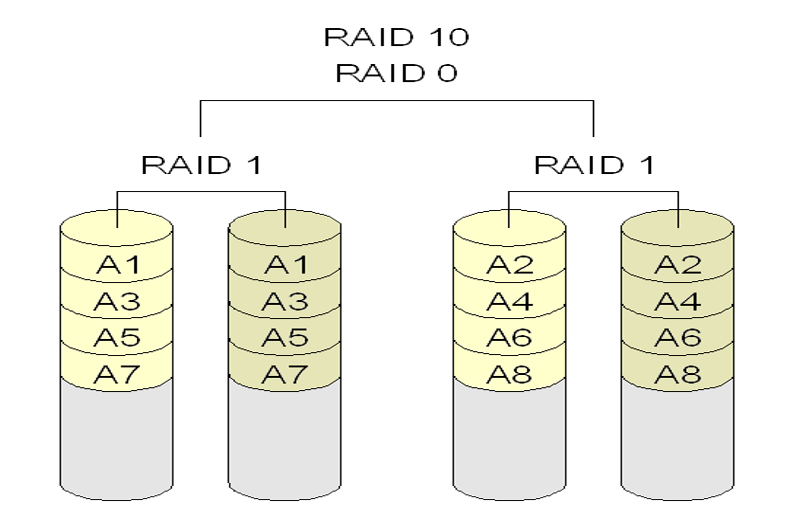

# CH11 Mass-Storage System

## Overview

### Hard Disk Drives

+ A HDD consists of a number of *platter* (雙面可讀寫)
  + covered with magnetic material
  + store information by recording the corresponding **magnetic pattern** (0, 1)
+ The **platters** are all bound together around the **spindle** (軸)
  + The spindle is connected to a motor that spins platters *at a fixed rate*
  + The speed is specified by **rotations per minute (RPM)**
+ A platter is divided into tracks
+ A track is further subdivided into **sectors** which are the smallest unit of transfer. (sector 為硬碟存取最小單位，目前主流為 512 bytes \~ 4KB)

**I/O Time**

+ Seek time: the time to move disk arm to desired cylinder (track)
+ Rotational delay: sector 轉到讀寫頭的延遲
+ Transfer time: I/O

### Write back & write through

+ write back: write data to cache and notify system that it is completion of write procession.
+ write through: besides write data to cache, it write data to HDD

### Non-volatile Memory

Electrical rather than mechanical devices. e.g., SSD (Solid-state disks)

> + Good
>   + Can be more reliable than HDDs as no moving parts
>   + Can be faster since no seek time and rotational latency
>   + Less power
>   + Light weight
>   + Small size
>   + Shock resistance
> + Bad
>   + More expensive per MB
>   + Less capacity
>   + Maybe have **shorter life span**

1. **A block consists of number of pages**, typically 64 pages.

2. Three operation: read, write and erase

   | Operation | Area  |
   | --------- | ----- |
   | Read      | Page  |
   | Write     | Page  |
   | Erase     | Block |

3. Read and written in page unit (寫入放大，即使你只想寫一個 Byte 也不行，一次只能寫一個 page)

4. Can't overwrite in place

5. An overwrite must first be erased, and erases happen in block

6. A block can only be erased a limited number of time before worn out

#### How to handler an overwrite

+ **in-place**: erase and then overwrite (不好，這樣子很容易消耗壽命)
+ **out-of-place**: write to another free page

#### NAND Flash Controller Algorithm

因為 out-of-place 所以硬碟資料的位置會一直跑

**Sol. FTL(Flash Translation Layer)** SSD 獨有

+ Maintained by the SSD controller
+ Address mapping: logical block → physical page
+ Enable SSD to emulate the HDD's interface

#### GC

Besides, due to out-of-place update, many pages may become invalid.

Sol. GC (Garbage Collection), GC is also performed by FTL 

為了實現 GC 硬碟必需額外配置空間

Sol. Over provisioning space

+ To provide working space (frequently 20 percent of the total) for GC writes
+ Also help to prolong the life space of devices

reference: [https://www.owlfox.org/blog/2019-11-27-coding-for-ssd-part-3/](https://www.owlfox.org/blog/2019-11-27-coding-for-SSD-part-3/)

### Volatile Memory

DRAM can also be used as a storage device

RAM drives (or RAM disks). Partition a section of the DRAM and present it as a storage device. Allow users to place data in memory using file operation. e.g., Linux */dev/ram*, and */tmp*

### Secondary Storage Connection Methods

Two mainly busses with computer

1. System bus: handled by northbridge
   + aka memory controller hub
2. I/O bus: handled by southbridge
   + aka I/O controller hub

### Address Mapping

For abstraction, disk drives (HDDs or SSDs) are addressed as large arrays of logical blocks

The logical block is the smallest unit of transfer

Thus, OS issues I/O requests **by Logical Block Number (LBN)** or **Logical Block Address(LBA)**

## HDD Scheduling

File system 會知道哪個檔案對應到哪個區域，比如區域 10，而區域 10 實際對應到哪則由 HDD 或 SSD 自己做管理

OS is responsible for using hardware efficiently. For the disk drives, this means have fast access time and disk bandwidth.

**Example**

系統先後請求資料 18, 6, 33 則應該改成 6, 18, 33 來讀以此來減少讀寫頭移動的距離

### FCFS Scheduling

First-come, first-served (FCFS) algorithm

### SCAN Scheduling

SCAN algorithm sometimes called the elevator algorithm

類似最一開始舉的例子，也類似電梯載客的方法。

但是這個排程方法有個問題，假設 request 是 uniform 分布的，當電梯從 15 樓往 1 樓下降時，電梯抵達 1 樓時，15 樓累積的乘客人最多，而且電梯從 1 樓再前往 15 樓時又得等更久；換句話說，中間的樓層最容易被服務，而最高層和最低層最難被服務

### CSCAN Scheduling

Circular SCAN (C-SCAN), CSCAN Scheduling 改善 SCAN Scheduling

當電梯由 15 樓沿途載客載到 1 樓時，電梯會直接從 1 樓返回 15 樓，返回過程不載客，如此一來即可解決 SCAN Scheduling 對端點區域不友善的問題

---

In older system, OS did all the scheduling. In the past, HDD interfaces required that the host specify which track and which head to use. OS would pick the best one and issue it to the disk. But, currently, the drive geometry is not available to the host OS. Rather, **it sees an array of (logical) blocks.** 現在的 OS 不需也不行自己實現 SCAN 和 CSCAN

在現代的架構中，OS 只負責做 Block number 的排序，排程的部分則由 HDD 或 SSD 自己管理

### Disk-Scheduling Algorithm is OS

Linux includes following scheduling algorithms

+ Deadline scheduler
+ Noop (Usually used for SSDs)
+ Completely Fair Queuing scheduler (CFQ)

#### Deadline disk-scheduling algorithm

Maintains separate read and write queues

Implement four queue: 2 read queues and 2 write queues

+ 1 read queue and 1 write queue sorted by LBA(logical block address) order
+ 1 read queue and 1 write queue sorted by FCFS(first come first serve) order

All I/O requests sent in **batch** sorted in LBA order. After each batch, checks if any requests in FCFS queue older than a configured age (default 500 ms for read and 5 second for write). If so, LBA queue containing that request is selected for next batch of I/O

#### CFQ scheduling

Completely Fair Queuing scheduler(CFQ)

Provides a separate queue for each process and serves requests of queues in **round robin** order. In this manner, the CFQ scheduler guarantees completely fair I/O service to all processes.

#### Other issue

**I/O merging**

Important task performed by disk schedulers

I/O merging 可以減少對 I/O 的 request

## NVM Scheduling

NVM 沒有機械裝置，不用特別去做排程

因此一般都是直接用 First come first serve 就可以了，但是還是要做 I/O merging

## Storage Device Management

### Drive Formatting, Partitions

Low-level formatting or physical formatting: before a device can store data, it must be low-level formatted.

> HDDs: divide a disk into sectors that controller can read/write
>
> SSDs: pages are initialized and the FTL is created.

Low-level formatting 是工廠在做的事，買硬碟前已經格式化好了

Fill each sector or page with a special data structure: header - data - trailer

Before a drive can hold files, OS still needs to record its own data structures on the device. It does so in 3 steps

1. partition
2. volume creation and management
3. logical formatting: stores the initial file-system data structure onto the device

### Linux Volume Creation and Management

Add flexibility for storage management. Linux can create logical volumes from multiple physical volumes.

### Clusters

To increase efficiency, most file systems group block into **clusters** (aka allocation unit). 

+ Disk I/O done in blocks
+ File I/O done in clusters
  + File system allocate contiguous groups of blocks, called clusters, for each file.

比如原本一個檔案 A 占了 3 個 blocks, 檔案 B 緊接著檔案 A 占了  4 個 blocks，若今天要增加檔案 A 的內容則勢必會將新的內容接在 B 的後面形成 A B A' 的局面，這個對於 HDD 不太合適

### Bootstrap

Bootstrap program initializes system

First step: **Bootstrap loader**

+ small piece of code -- bootstrap loader, BIOS, stored in **NVM flash memory** or **ROM** or **EEPROM**
+ 為儲存設備引入一個完整的 bootstrap program

Second step: **Bootstrap program**

+ stored in boot blocks of a boot disk
+ more sophisticated than the bootstrap loader
+ able to load the entire OS from a non-fixed location on the device and to start the OS running

### Bad blocks

Most disks even come from the factory with bad blocks. Increased over the life of the disk.

The controller maintains a list of bad blocks on the disk

**sector sparing** or **forwarding**

+ replace each bad sector with one of the spare(備用) sectors
+ spare sector are not visible to OS

block 毀損時，自動導向到備份的 block, 而這個備份的 block 會盡量在毀損的付近

Example // TODO

NVM devices also have bad pages at manufacturing time or go bad over time

## Swap-space management

A swap space can reside in one of two places

1. can be in raw partition
   + Use a disk partition as large sequential array of logical blocks
   + pros: faster then file system I/O
   + cons: need to manage the raw partition space
2. a file within a file system

Linux supports both approaches

+ In older BSD Unix
  copy entire process image to swap space at process load time

+ In windows
  Demand **Text-segment** page form file system **initially**, but write the pages to swap space when they are replaced.
  Re-read it from swap space if needed again.

+ In Solaris and Linux

  **Text-segment** pages are brought in from file system and **thrown away** if selected from page out. (因為 text segment 不會改變)

  Swap space is only used as a backing store for pages of anonymous memory(anonymous memory: memory not backed by any file, e.g., stack, heap, and data)

## Storage attachment

Computers access storage in three ways

+ Host-attached
+ Network-attached
+ Cloud

### Host-attached storage

Host attached access through I/O ports, using one of several technologies. The most common being **SATA**.

### Network-attached storage

NAS access storage across a network.  The storage present 

+ as a *file system*
  + remotely attached as a file system
  + use NFS (Unix) and CIFS (Windows) as protocols
+ as a *raw block device*
  + iSCSI protocol is used: used the TCP/IP over Ethernet to carry the SCSI commands
  + iSCSI sends logical blocks across the network

### Cloud storage

similar to NAS, provides access to storage across a network, but usually via Internet (NAS usually use LAN)

## Storage-Area Networks and Storage Arrays

1. Use a dedicated networking architecture (全部手幹)

   > High-speed architecture used in high-end systems. But, high cost
   >
   > e.g., Fibre channel (FC), Infini Band (IB)

2. Built on top of the TCP/IP

## Raid Structure

Raid - **r**edundant **a**rray of **i**nexpensive **d**isks, use of multiple disks working cooperatively.

Goal

+ improve *reliability* via redundancy
+ improve *performance* via parallelism

### redundancy

+ Mirroring: 把資料同時寫在兩顆硬碟中
+ Parity bits: even parity or odd parity

### Parallelism

+ With disk mirroring. Read requests can be sent to either disk. Thus, the number of reads per unit time has doubled

+ With multiple disks by **data striping** (將資料拆開同時寫入不同顆硬碟)

### RAID Levels

+ **Mirroring** provides high reliability, but expensive
+ **Parity** provides acceptable reliability and cost
+ **Striping** provides high data-transfer rates, but it does not improve reliability. 

#### RAID Level 0

| Disk0 | Disk1 |
| ----- | ----- |
| 0     | 1     |
| 2     | 3     |
| 4     | 5     |
| 6     | 7     |

#### RAID Level 1

Drive mirroring

| Disk0 | Disk1 |
| ----- | ----- |
| 0     | 0     |
| 1     | 1     |
| 2     | 2     |
| 3     | 3     |

#### RAID Level 4

Saving space with parity

| Disk0 | Disk1 | Disk2 | Disk3 | Disk4 |
| ----- | ----- | ----- | ----- | ----- |
| 0     | 1     | 2     | 3     | P0-3  |
| 4     | 5     | 6     | 7     | P4-7  |
| 8     | 9     | 10    | 11    | P8-11 |

When we want to write Block 4 and Block 9 simultaneously, P4-7 and P8-11 in disk4 need to be written. We can use RAID Level 5

#### RAID Level 5

| Disk0 | Disk1 | Disk2 | Disk3 | Disk4 |
| ----- | ----- | ----- | ----- | ----- |
| 0     | 1     | 2     | 3     | P0-3  |
| 4     | 5     | 6     | P4-7  | 7     |
| 8     | 9     | P8-11 | 10    | 11    |

#### RAID Level 6

| Disk0 | Disk1 | Disk2 | Disk3 | Disk4 |
| ----- | ----- | ----- | ----- | ----- |
| 0     | 1     | 2     | P0-2  | P'0-2 |
| 3     | 4     | P3-5  | P'3-5 | 5     |
| 6     | P6-8  | P'6-8 | 7     | 8     |

#### Computing parity

| C0   | C1   | C2   | C3   | P                |
| ---- | ---- | ---- | ---- | ---------------- |
| 0    | 0    | 1    | 1    | XOR(0,0,1,1) = 0 |
| 0    | 1    | 0    | 0    | XOR(0,1,0,0) = 1 |

**How about overwrite?**

*Method1: additive parity*

Read in all of the other blocks and XOR the new block to generate the new parity

*Method2: subtractive parity*

Compare the old data and the new data

if(block_new = block _old), P_new = P_old

if(block_new != block_old), P_new = ~P_old

Above description can be performed by:

P_new = (B_old xor B_new) xor P_old

**for example**

| C0   | C1   | C2   | C3   | P                |
| ---- | ---- | ---- | ---- | ---------------- |
| 0    | 0    | 1    | 1    | XOR(0,0,1,1) = 0 |

If C2 changed to 0

*Method1: additive parity*

P_new = XOR (0,0,0,1) = 1

*Method2: subtractive parity*

P_new = XOR(1,0,0) = 1

#### RAID Level 0 + 1 and 1 + 0 

+ RAID Level 0 + 1: A set of drive are striped, and then stripe is mirrored

+ RAID Level 1 + 0: Drives are mirrored in pairs and then the mirrored pairs are stripped

RAID 1 + 0 比 RIAD 0 + 1 多一個好處，當有一個 drive 毀損時， RAID 0 + 1 會有一套 Stripe 不能用，而 Raid 1 + 0 則僅僅那個壞掉的 drive 不能使用

### Other features

Regardless of where RAID implemented, other useful features can be added

+ snapshot
  A view of a volume or file system from a particular point in time
  + protect accidental data deletion/modification
  + keep the previous of data
+ replication in duplication of writes between separate site
  + protect disk and site failure
  + keep the most recent data
+ hot spare connected as part of a working system
  + connected as part of a working system, fully functional drives that contain no data.
  + If a disk fails, RAID5 automatically rebuild data to a hot spare to replace the failed one