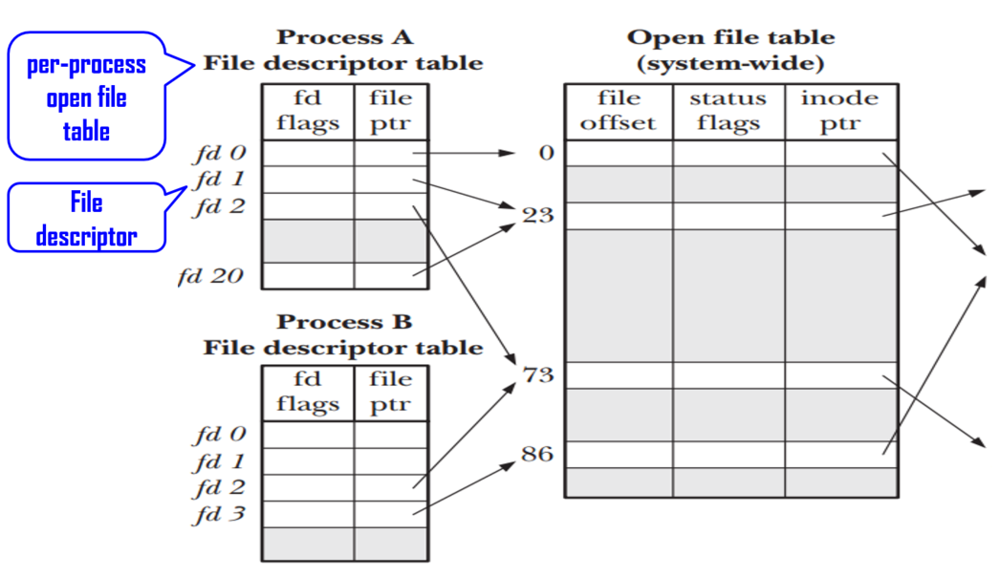
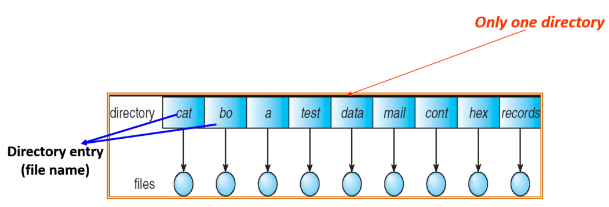

# Chapter 13

OS abstracts from the physical storage devices to define a logical storage unit: File

## File attributes

1. Name
2. Identifier, unique tag identifies file within file system
3. Type
4. Location - file's location on device
5. Size
6. Protection - controls who can do reading, writing, executing
7. Time, date, and user identification

## Open a file

### Typical Open-file-table

| index | file name | permissions | access dates | pointer to disk block |
| ----- | --------- | ----------- | ------------ | --------------------- |
| 0     | TEST.C    | rw rw rw    | ...          | ...                   |
| 1     | FOO.txt   | rw          | ...          | ...                   |
| 2     |           |             |              |                       |

### Two levels of tables in OS

However, in a multi-user OS, **several processes** may open the same file at the same time. Solution: two levels of table.

+ Per-process table: all the files opened by a process
  + Keep process-dependent information.
+ System-wide table: all the files opened by all processes
  + Contain process-independent information

### File locking :lock:

How to prevent other processes from gaining access to a file?

1. **Advisory(諮詢) locking** (不檢查, UNIX systems)
   OS will prevent another process to access a shared file if this process does not acquire lock first

2. **Mandatory(強制) locking** (檢查, Windows OS)

   OS will prevent another process to access a shared file even if the process does not acquire lock first

### File type

Except executable files (*.com* or *.exe*), file types are only recognizes by user applications, not by OS. OS recognizes executable files to know how to load and run programs.  

### File structure

File types can also indicate the file structure. For example, txt - ASCII characters, .ppt - power point

## Access Methods

+ sequential access: based on a tape model that information in a file is processes in order
+ direct access: based on disk model of a file. A file is made up of fixed length logical blocks
  + Model1: include the block number as a parameter. read *n* or write *n*
  + Model2: position to *n*, read next or write next
  + n= relative block number
+ other access methods

## Directory structure

> + Efficiency - locating a file quickly
> + Naming: convenient to users
>   + Two users can have same name for different files
>   + The same file can have several different names
> + Grouping: logical grouping of files by properties.

### single level directory

### Tree-structured directories :evergreen_tree:

+ how to handle the deletion of a directory?
  1. DOS: A directory can be deleted only if empty
  2. Windows & Unix: Deleting a directory causes that the directory's files and subdirectories are all deleted.

## Protection

File owner/creator should be able to control what operations can be done on this file by whom

### Access control

Idea: make access dependent on the identity of the user. That is to say, different users may need different types of access to a file or directory

**Solution: ACL (Access control list)**

A list of (user names/ids, allowed access types) associated with each file and directory.

Pros: enabling complex access methodologies

Cons: ACL may be very long

