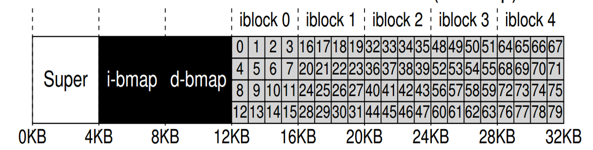
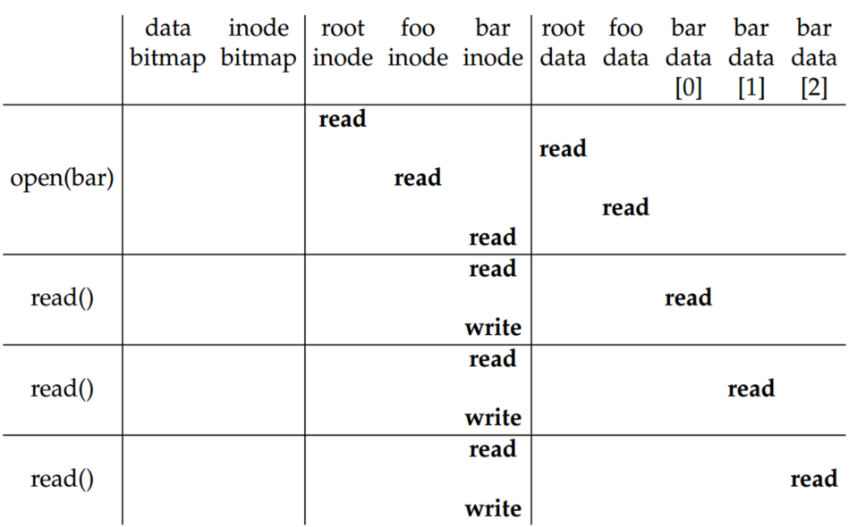
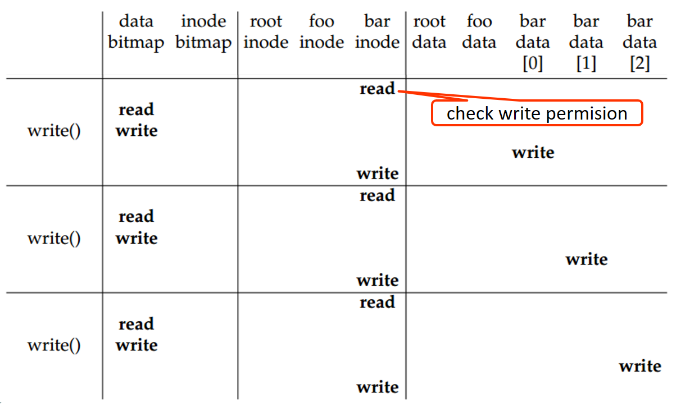
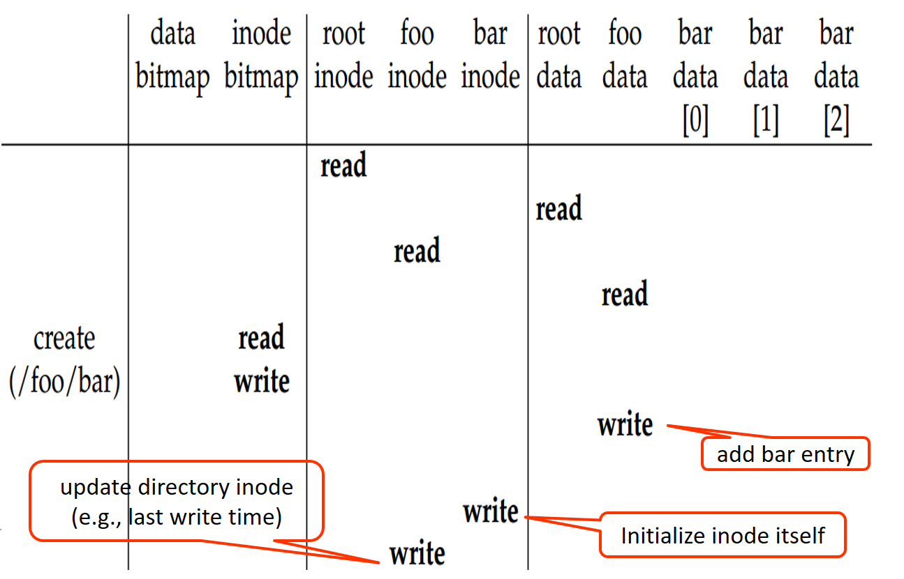

# CH14 File-system Implementation

## Very simple file system (VSFS)

Goal of a file system:

1. Map files onto physical devices
2. Provide file access's interface

> Data structure → on-disk
>
> Algorithm → ?

### Structure

硬碟上的單位就是一個 Blcok (常見的大小是 4 KB)

每一個檔案除了要有本身的資料 (data region)，還要有一個存放 meta data 的部份 ，我們稱這些資料為 inode (inode table)，因此我們要把硬碟分成兩部分，一部分是 inode table，一部分是 data region

當然這樣子還不夠，我們需要有一個能儲存哪一個 data region 已使用，為了實現這部分，我們再以 data bitmap 來對應。同理 inode table 也需要有 inode bitmap

另外，我們再額外切一個部分 ─ super block ─ 用來存放一些硬碟相關訊息，比如 inode table 的起始位置，根目錄的 inode

#### Directory

因為我們現在把檔案的 meta data 存在 inode 裡了，因此資料夾不用再像上一章一樣存檔案的 Meta data 了，直接存 inode number 就可以了

| iNode | name                         |
| ----- | ---------------------------- |
| 5     | .                            |
| 2     | ..                           |
| 12    | foo                          |
| 13    | bar                          |
| 24    | boobar_is_a_pretty_long_name |

資料夾 → 透過檔名找到 inode → inode 得到 meta data 並得到 data block → data block 存取資料

#### Open(), Read(), Write()

> + /
>   + bin/
>   + foo/
>     + bar.txt

**open(bar.txt) & read()**

1. 若檔案在越深的位置則 open 一個檔案所要 read 的次數就越多，也因此衍生出 object-based storage
2. 為什麼 bar inode 要 write 呢？因為 meta data 裡有一個 last accessed 的屬性，因此每次 read 時都要進行修改，因為頻繁讀寫硬碟很吃效能所以有些步驟會靠記憶體快取來完成

**write(bar)**

1. 第一個 read 是用來 check 是否有可寫之權限，寫入之前要看 data bitmap 哪個是空的，有空的才能寫入，並把 data bitmap 改為 1，更改後要記得前往 bar inode 更新 meta data

**open("/foo/bar", O_CREAT)**

1. 首先要先抵達 foo 的 data block
2. 接著尋找空的 inode bitmap，以建立新的 metadata，先將該 inode 寫回 foo 資料夾，再去初始化剛要來的 inode block ，最後在更新 foo 的 metadata

### Performance

open, read, write 會花費很多硬碟的讀寫，因此需要使用 cache 的技巧來改善效能

+ Read caching:
  + Not only for data block but also inode
  + Not only files, but also directories
+ Write buffering (將要寫回去的資料先寫在記憶體，OS 再找時間批次寫回硬碟)
  + Can **reduce** the write response time
    + Write 到 page cache 就結束了
  + Can **batch** writes into a larger I/Os
    + 存取硬碟 size 越大越好，OS 可以把多筆寫入合成一筆再寫入
  + Can **schedule** the I/Os to increase performance
    + Page cache 寫回到 Disk 前可以做排程
  + Can **avoid** some writes, e.g., overwrites
    + 使用者可能會對同一個 block 寫入很多次，但其實只要把最後一次寫入硬碟即可

## Directory Implementation

The selection of directory-allocation and directory-management algorithms significantly affects the efficiency, performance, and reliability of the file system.

### Linear List

The simplest method of implementing a directory is to use a linear list of file names with pointers to the data blocks.

+ Pros: simple
+ Cons: time-consuming for finding a file.

### Hash Table

This method can greatly decrease the directory search time.

## Allocation Methods

In almost every case, many files are stored on the same device. The main problem is how to allocate space to these files so that storage space is utilized effectively and files can be accessed quickly.

### Contiguous Allocation

Contiguous allocation requires that each file occupy a set of contiguous blocks on the device. Device addresses define a linear ordering on the device/ Contiguous allocation of a file is difined by the address of the first block and length of the file. If the file is *n* blocks long and starts at location *b*, then it occupies blocks *b*, *b+1*, ..., *b+n-1*.

Contigious allocation has some problems, however. One difficulty is finding space for a new file. The system chosen to manage free space determines how this task is accomplished.

Besides, when the file is created, the total amount of space it will need must be found and allocated. To minimize these drawbacks, an opearting system can use a modified contiguous-allocation scheme. Here, a contiguous chunk of space is allocated initially. Then, if that amount proves not to be large enough, another chunk of contiguous space, known as an extend, is addes.

Contiguous allocation is easy to implement but has limitations, and is therefore not used in modern file systems.

### Linked Allocation

Linked allocation solved all prolbems of contiguos allocation. The blocks may me scatteded anywhere on the device. Each block contains a pointer to the next blcok.

The major problem is that is can be used effectively only for sequential-access files. To find the *i*th block of a file, we must start at the beginning of that file and follow the pointers until we get to the *i*th block. In addition, becuase we need to sotre the pointer, we require slightly more space.

The usual solution to this problem is to collect blocks into multiples, called **clusters**, and to allocate clusters rather than blocks.

