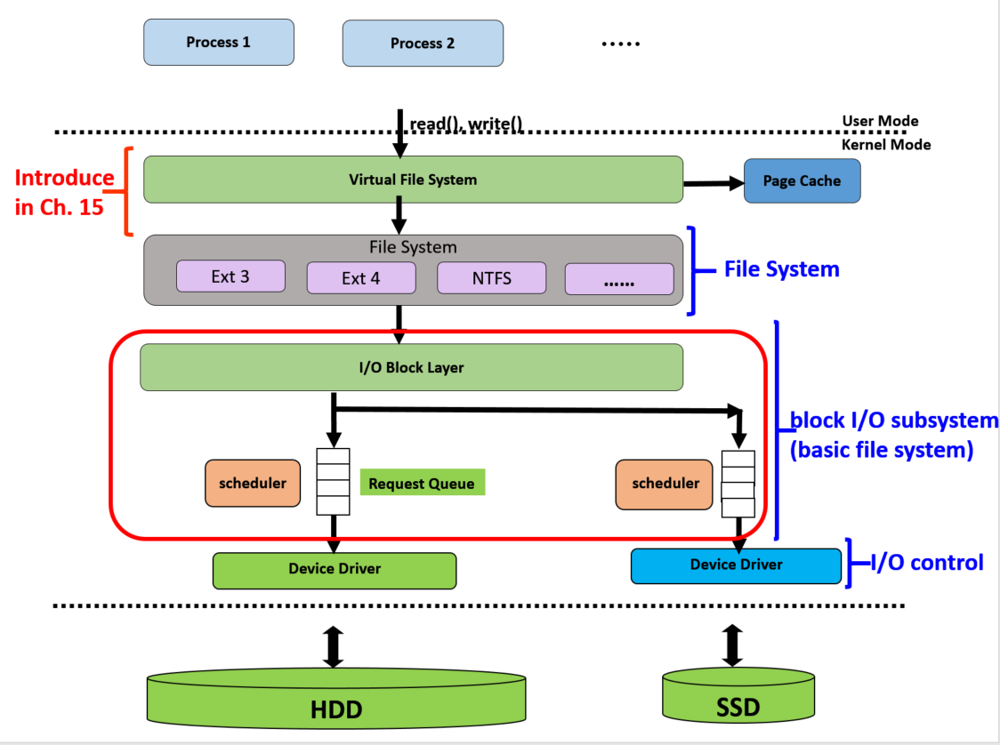
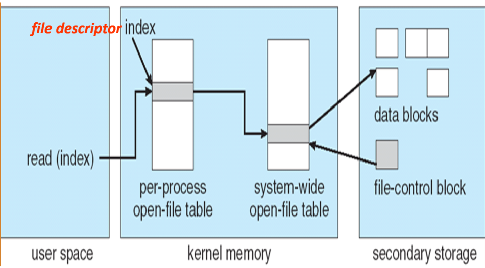
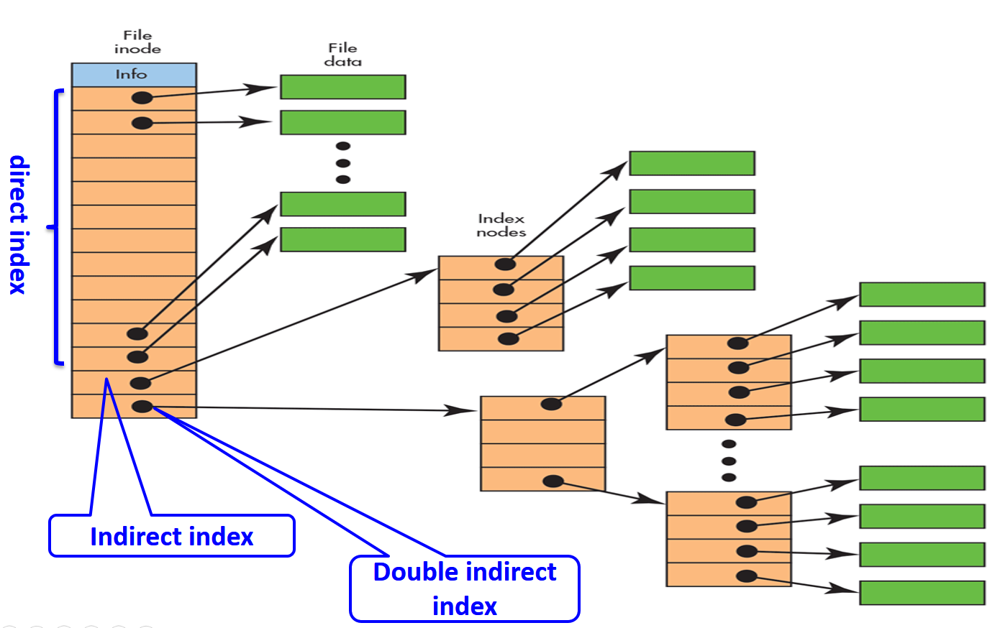
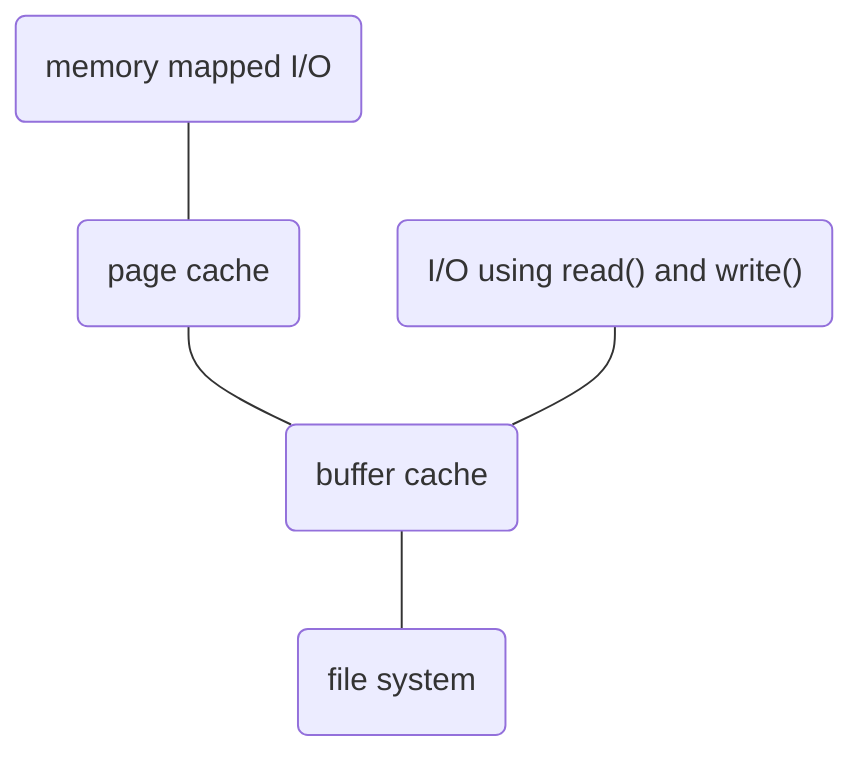
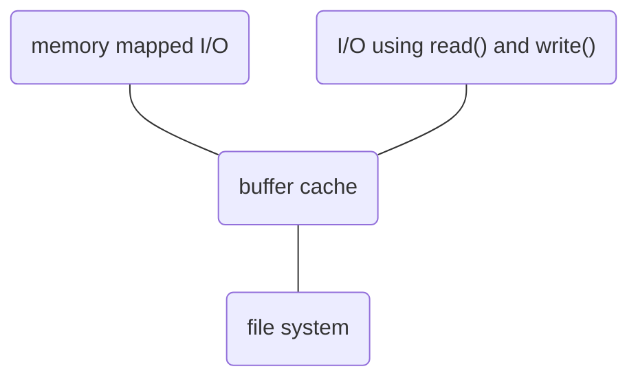

# File system implementation

[TOC]

## File system structure

1. Application programs
2. logical file system **aka virtual file system**
   + 因為有不同的 file system (Ext4, NTFS) 指令不同，virtual file system 會轉換 read() → ntfs_read()
3. file-organization module **aka File system** e.g. Ext3, Ext4, NTFS, ...
   + File system converts files to logical block numbers. 
4. basic file system **aka block I/O subsystem**
   + Manages the memory **buffers** and **caches** 
   + Perform **I/O** **request scheduling**
   + Send requests to the appropriate **device** **driver**
5. I/O control (device driver + interrupt handlers)
   + Logical Block Number → Physical Block Number
6. devices

**File system (file→ logical block number)**

> 1. manages **metadata** information for all of the file system structure
>
> 2. manages **directory structure**
>
> 3. maintain **file-control blocks (FCBs)** aka **inode**
>
> 4. file, offset → Logical Block Number (LBN)
>
>    透過 inode
>
> 5. free space manager: track unallocated blocks in disk
>
>    透過 data bitmap, inode bitmap
>
> 6. blocks allocation:
>
>    provides free blocks when requested

**block I/O subsystem**

這裡會將 logical block number 做排程，比如原本要讀 block 1, 2, 3，但若 cache 裡已經有 1, 2 的資料了，所以只要讀 3 就好，剩下的部分用 cache 就可以

**I/O control (device drivers)**

Consists of device drivers and interrupt handlers

I/O control 會轉換 CPU 指令 (port-mapped I/O memory-mapped I/O)

也會將 Logical block number 轉成 Physical block number

### On-disk structure

+ boot control block (如果該硬碟可以開機的話)

  > Unix-based system: **boot block**
  >
  > NTFS: **partition boot sector**

+ volume control block

  > Unix-based system: **super block**
  >
  > NTFS: **master file table**

+ file control block: detail about files

  > Unix-based system: **inode**
  >
  > NTFS: **master file table**

### In-memory information

Used for file system management and performance improvement

+ mount table
  + 把 super block cache 到記憶體
+ in-memory directory-structure cache
  + 把資料夾的資訊 cache 到記憶體
+ system-wide open-file table (可以在程式間共享的 open-file table: 檔案名稱、位置 ... 等)
+ per-process open-file table (程式自己有的 open-file table: 檔案讀到的位置、permission...等)

## Operations

### Open

open a file - first searches the system-wide open-file table, if the file is already in use by another process.

+ A <u>per-process open-file</u> table entry is created
+ The <u>system-wide entry's</u> **open count** (代表有幾個程式在存取這個檔案) is incremented

Otherwise, 

+ Search **directory structure (directory** **file)** for the given file name

+ **FCB** (inode) is copied into the **system-wide open-file table**

+ Create an entry in the **per-process open-file table**

+ Return an index, called **file descriptor** (Unix) or **file handle** (Windows), to the entry in the per-process table

  `fd = open("file_path")`

### Close

+ The **per-process open-file table is removed**
+ **Open count** (system-wide open-file table) **is decremented**
+ If open count == 0
  + Any updated metadata are written back to the disk-based directory structure
  + Remove the system-wide open-file table entry

## Hard links & Symbolic links

filesystem 一般都是以 tree 的結構來儲存路徑，透過 links 的方式可以改成 acyclic-graph，主要有兩種 link，hard link 及 symbolic link (soft link)

### Hard link

hard link 直接將其新的 pathname 指向其欲指向檔案的的 inode，並且將 inode 中的 reference count 加 1。當我們刪除任一個 Hard link 或原檔時，會將 reference count 減 1，直到最後一個檔案也砍掉時，檔案才會真的被刪除

**限制**

1. Hard link 沒辦法跨檔案系統，不同檔案系統的 inode 格式不一樣
2. 不能 link 目錄 → 避免產生 cycle
3. 存取權限與原檔案相同

### Symbolic link

symbolic link 是一個特殊的檔案，有自己的 inode，自己的 datablock，只是他的 datablock 會指向另一個檔案的 pathname

| Hard Link                                                    | Symbolic link                                                |
| ------------------------------------------------------------ | ------------------------------------------------------------ |
| 1. 不能跨檔案系統 2. 不能指向資料夾 3. 權限與原檔相同 4. 所有 hard link 都刪除檔案才會刪除 | 1. 可以跨檔案系統 2. 可以指向資料夾 3. 可以設定與原檔不同的權限 4. 原檔刪除則永久刪除 |

## Directory Implementation

Directory 主要是由檔名與 inode 對應的 entry 所組成

| inode | name |
| ----- | ---- |
| 5     | .    |
| 2     | ..   |
| 12    | foo  |
| 13    | bar  |

### Liner list

用最簡單的 liner list 將 entry 串起來，缺點就是速度太慢，搜尋最差要 O(N)

解決方法

1. Caching
2. Sorted list (但為了保持排序也會付出相對的代價)
3. Advanced data structure
   1. B-Tree (有點類似 binary tree，但比 binary tree 還要彈性)
   2. binary tree

### Hash Table

利用 hash table 將檔名與 inode 對應，麻煩的就是要解決 collision 的問題

## Allocation methods

**Goal**

1. Disk space is utilized effectively
2. Files can be accesses quickly

### Contiguous allocation

Contiguous allocation requires that each file occupy a set of contiguous blocks on the device. Device addresses define a linear ordering on the device/ Contiguous allocation of a file is difined by the address of the first block and length of the file. If the file is *n* blocks long and starts at location *b*, then it occupies blocks *b*, *b+1*, ..., *b+n-1*.

Contigious allocation has some problems, however. One difficulty is finding space for a new file. The system chosen to manage free space determines how this task is accomplished.

Besides, when the file is created, the total amount of space it will need must be found and allocated. To minimize these drawbacks, an opearting system can use a modified contiguous-allocation scheme. Here, a contiguous chunk of space is allocated initially. Then, if that amount proves not to be large enough, another chunk of contiguous space, known as an extend, is addes.

Contiguous allocation is easy to implement but has limitations, and is therefore not used in modern file systems.

 將檔案的 data block 分配成連續的 block

| file | start | length |
| ---- | ----- | ------ |
| foo  | 0     | 2      |
| bar  | 12    | 3      |

Pros：

1. Fast
2. Simple
3. Support both sequential and direct access

Cons:

1. 跟 memory 分配有一樣的問題：External fragmentation

   解法：compassion，但很花時間

2. create 時必需要先知道這個檔案有多大

3. 檔案擴大時可能會沒有辦法連續

### Extent-based allocation

將 contiguous allocation 再做修正，使其可以保有連續的快速性以及非連續的彈性，減少 (但仍然有) external fragmentation 發生

| file |        |        |         |
| ---- | ------ | ------ | ------- |
| foo  | (0, 2) | (6,2)  | (16, 2) |
| bar  | (3, 1) | (8, 2) |         |

### Linked allocation

Linked allocation solved all problems of contiguos allocation. The blocks may me scatteded anywhere on the device. Each block contains a pointer to the next blcok.

The major problem is that is can be used effectively only for sequential-access files. To find the *i*th block of a file, we must start at the beginning of that file and follow the pointers until we get to the *i*th block. In addition, becuase we need to sotre the pointer, we require slightly more space.

The usual solution to this problem is to collect blocks into multiples, called **clusters**, and to allocate clusters rather than blocks.

Pros:

1. No external fragmentation
2. Easy to grow (只要找到一個 free block 變行了)

Cons:

1. Inefficient direct-access (因為要知道前一個才能知道下一個)
2. Space required for the pointers (浪費空間)
3. Reliability (如果中間有一個 block 壞了，那整個檔案都會受牽連)

### Cluster allocation

aka **allocation unit** in windows

File system 的角度，每次產生新檔案時一次分配一個 cluster (硬碟沒有這個用法，是 file system 自己 handle 的)。比如可以設定一個 cluster = 4 blocks 那麼檔案系統就會以 cluster 為單位來操作硬碟。硬碟仍然是使用 block 為單位

Pros:

1. Fewer disk head seeks (原本每個 block 都要移動，現在只要一個 cluster 移動一次)
2. Decrease the space overhead (一個 cluster 只要記錄一個 pointer 就行)

Problem:

1. Increased **internal fragmentation** (一個 cluster 內可能有很多空間沒用完)

### FAT (File allocation tables)

A file system popularized by MS-DOS. Originally designed in 1977. FAT12, FAT16, FAT32. (數字越大可以支援容量越大的硬碟，FAT16 的 16 指的是每個 FAT entry 占 16 bits)。 

FAT is a variation of **Linked allocation scheme**

+ Maintain a **table** at the beginning of each volume
+ The **table** has one entry for each disk block and **is indexed by block number**

**FAT Table**

| This block (有照index順序) | Next block |
| -------------------------- | ---------- |
| ...                        | ...        |
| 50:                        | 51         |
| 51:                        | 52         |
| 52:                        | 160        |
| ...                        | ...        |
| 130:                       | EOF        |
| ...                        | ...        |
| 160:                       | 130        |

資料夾記錄的位置會指向 FAT 的位置比如指向 50，透過 FAT，可以知道 50 的下一個是 51，51 的下一個是 52，52 的下一個是 160，160 的下一個是 130，130 的下一個是 EOF

如此來我可以先在 FAT 預先知道 Block 的分佈，減少讀寫頭移動的次數，而且也沒有 external fragment 的問題

Pros: random access is improved

Cons: significant number of disk head seeks (但是 FAT 不大，可以在記憶體把 FAT Cache 起來)

### Indexed Allocation

vsfs 透過每個檔案的 index block 將 indexes 存起來

| the # of block | 0    | 1    | 2    | 3    |
| -------------- | ---- | ---- | ---- | ---- |
| index          | 9    | 16   | 1    | 10   |

用一個 block 來存每個檔案的 block 的位置，每個 file 都有自己的 block，但是這個儲存 block 位置的 index block 到底要多大呢？

Pros:

1. Well support for direct access
2. No external fragmentation

Cons:

1. Large index block: waste space for small files.
2. Small index block: how to handle large files?

**Mechanism for handling the index block**

1. **Linked scheme**: link together several index blocks (index block 保留第一個值接到下一個 index block, 類似 linked list)

2. **Multilevel Index**: 一個 Index table 再指向另一個 index table 形成 hierarchical 的樣子

3. **Combined scheme:** Direct blocks + indirect blocks + double indirect blocks + triple indirect blocks...

   Used in UNIX-based file systems, is to keep the first, 15 pointers of the index block in the file's inode. The first 12 of these pointers point to direct blocks. The next 3 pointers point to indirect blocks. The first points to a single indirect block. The second points to a double indirect blocks. The last pointer contains the address of a triple indirect block.

### Unix Combined Scheme

Unix 假設大部分都是小檔案，前面採用 direct index，效能好，大部分檔案有這些 index 就夠用了，只有少數幾個較大的檔案不夠用，所以針對大檔案改用 indirect index 增加 allocation 的彈性。

### Summary

+ **Contiguous allocation** great for sequential and random
+ **Linked allocation** good for sequential, but not for random
+ **Indexed allocation**
  + For a two-level index, two index-block reads might be necessary then the data block read
  + The performance depends on the index structure, the size of the file, and position of the block desired

## Free space management

### Bit vector

就是先前 vsfs 講的 bitmap 做法，第 i 個 bit 代表第 i 個 block，這個作法的缺點是需要有軟體的幫助，要把 bit vector 放進記憶體中，會消耗記憶體資源。

### Linked list

記錄 free block 的起頭，再把 free block 串成一個 linked list，不會像 bit vector 一樣浪費額外的空間 (因為指標是記在 free block). The FAT method incorporates free-block accounting into the allocation data structure. No separate method is needed.

**Pros**：節省空間

**Cons**：無法快速地找出多個位置相鄰的 block

### Grouping

假設 free space: 2 - 3 - 4 - 5 - 8 - 9 - 10 - 11 - 12 - 13 - 17 - 18 - 25 - 26 - 27

**if grouping n = 3**

+ Block 2 stores (3, 4, 5)
+ Block 5 stores (8, 9, 10)
+ Block 10 stores (11, 12, 13)
+ Block 13 stores (17, 18, 25)
+ Block 25 stores (26, 27, -1)

這樣可以改善 linked list 找出多個 block 的效能

### Counting

會記錄相鄰連續 block (起始, 個數), These entries can be stored in a balanced tree, rather than a linked list, for efficient lookup, insertion, and deletion.

(2, 4) - (8, 6) - (17, 2) - (25, 3)

 ### Delete and reuse

只要將 data bitmap 和 inode bitmap 清為 0 就可以了，不需要把裡面的 data block 清空，在 HDD 中這個做法很直覺，因為下次如果我要再次使用這個 data block 時，只要再把新的資料 overwrite 進去就可以了

但 SSD 不行，SSD 不可以做 in-place overwrite 的動作，SSD 若要做 overwrite 必需要先 erase 整個 block，erase 會傷 SSD，所以 SSD 會用 out-of place 來實現資料更動。若刪除 SSD 也利用 HDD 的手法，則 SSD 並不知道 data block 已經沒有用了 (只有 file system 自己知道)，則當 SSD 觸發 GC 時，仍會視此無用的 Block 為 valid → 浪費空間、浪費時間。

因此在刪除 SSD 上的資料時，除了 HDD 的那兩步外，還要多一步：呼叫 Trim command 告訴 SSD 哪個 block 已不再被使用，如此一來才能在 GC 發生時正確清理該筆資料

## Performance

**On board cache**: cache 在 disk controller 上

**Page cache (buffer cache)**: cache 在 main memory 上

**Asynchronous writes**

**Free-behind** & **Read-ahead**: 優化循序存取

### Double caching problem

Data may be cached in both **buffer cache** and **page cache**. 

↓ I/O without a unified buffer cache.

**solution: unified buffer cache**

將 cache 整合成 buffer cache aka page cache

### Asynchronous writes

Writes are stored in the cache and return to the caller (效能好，但相對也比較不安全)

**synchronous write**

Writes are not buffered. Caller must wait for the data to reach the disk drive. (效能差，但比較安全)

*Metadata are usually synchronous writes* (避免 inconsistent)

### **Free-behind** & Read-ahead

當 buffer 滿時要找一個踢掉，要怎麼踢呢？LRU (Least recently used)？

1. 有可能把會用到的踢掉
2. 很多資料根本不會在用到

**Free behind**

Remove a page from the buffer as soon as the next page is requested. (當我們從 buffer 讀到該筆資料時就把該筆之前的資料都刪除，因為通常讀過一次後就不會再讀了)

**Read ahead (prefetch)**

先把接著可能讀到的資料先讀進 buffer (類似 Youtube 影片先跑的進度條)

## Recovery

### Consistency Checker 

UNIX: fsck (file system checker)

Windows: chkdsk

### Backup and restore

**checkpoint**

做備份時不需要每次都將整顆硬碟做備份，只要第一次整顆備份後，以後的備份只要備份有修改的部分即可，這個技術成為 incremental backup

Restore 的時候先恢復整個 filesystem，接著再按照 incremental backup 的順序恢復，就可以變回來了

