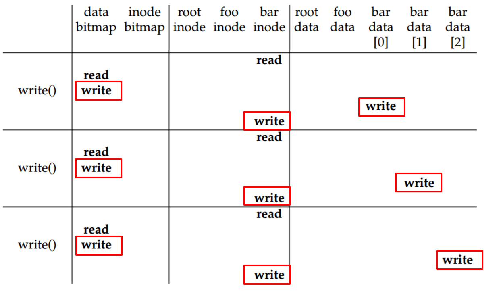
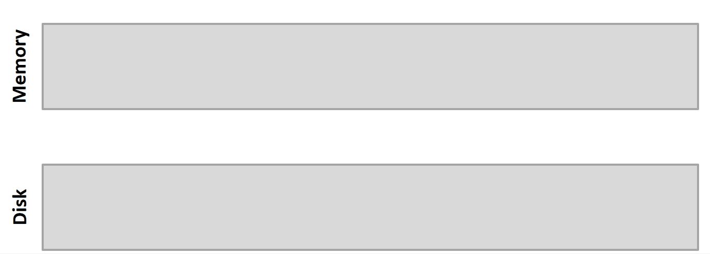
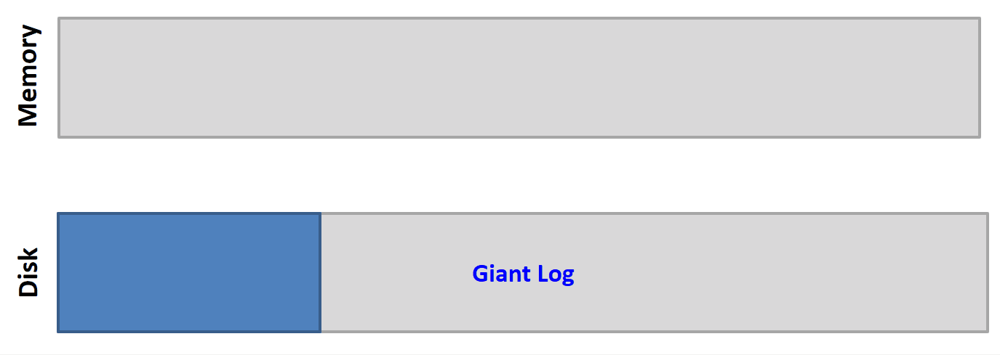
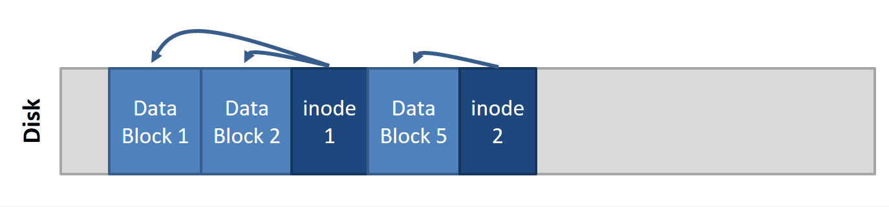

# Log-structure File System (LFS)

> 目前作業系統因 RAM 越來越大，所以主要IO的時間都花在 Write 上，因此我們希望提高 Write 的效能，是否可以讓 Write 時變成 Sequential write 呢？

vsfs 中若要在 /foo/bar 寫檔，讀寫頭需要一直移動

可以先將要 write 的部分先存在 RAM 裡面，最後再一次全部寫進硬碟，簡單來說就是把硬碟當成很大的 "circular queue"。想法很簡單，但實作上相當複雜，inode 會一直浮動，另外也要解決 GC 的問題。

有幾個由 LFS 衍生出來的 File system

+ Copy-on-write file system

  > Update data is written to empty space on disk rather than overwrite

+ Versioning file system

  > Old version of files may be useful. Many modern file systems are versioned. The user may **roll-back** a file to recover old versions
  >
  > LFS 會 GC, versioning file system 不會

LFS 的思維

Buffer all writes (including data and metadata) in memory. When the segment is full, written to disk in a single large sequence disk write. Treat the disk as a log, i.e., do not overwrite.

LFS convert many small random writes into large sequential transfers. Since segment are large, the disk throughput approaches its peak performance

LFS 一直往後加的特性導致 inode 一直浮動

**LFS GC**

GC 實際相當複雜，以下只是概念呈現

