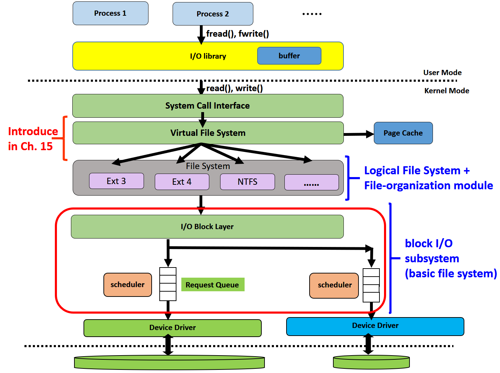
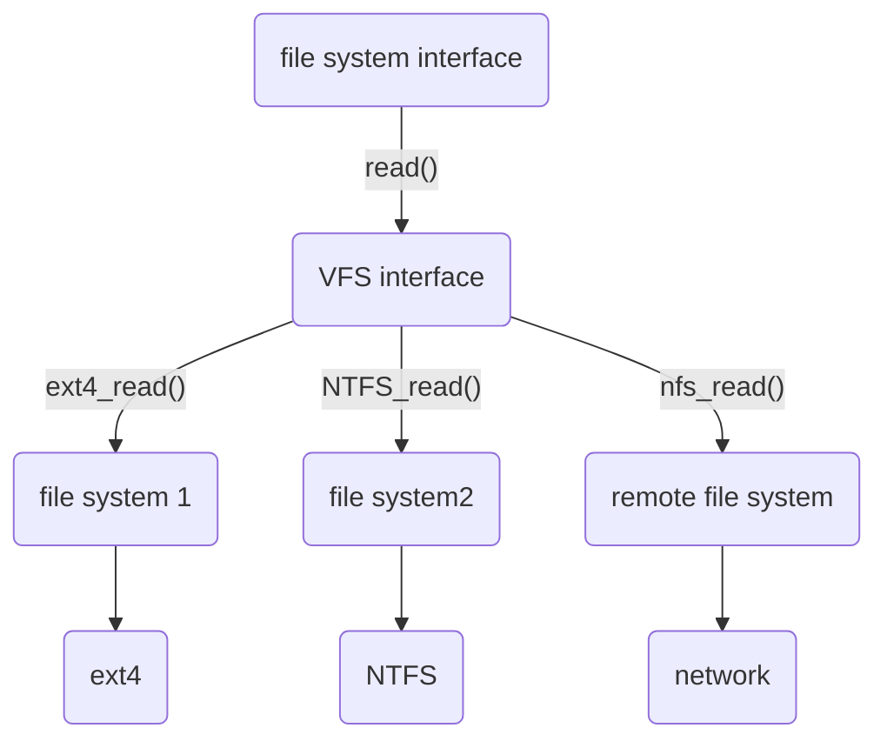
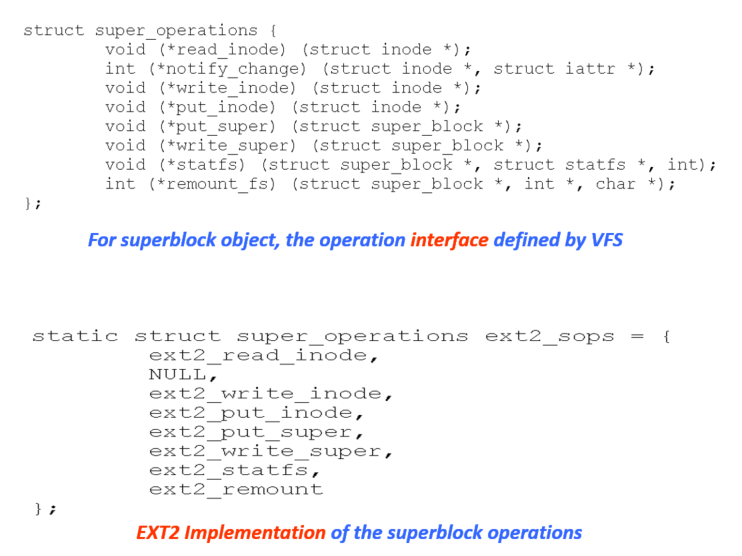

# File system internals

General-purpose computer system can have multiple storage devices.

Those devices can be sliced into **partitions**. partition 可以組合成一個 volume, volume 可以裝不同的檔案系統

+ Partitions
  + Raw: 沒有檔案系統
  + Cooked: 有檔案系統
  + Root partition: contains OS, mounted at boot time

File system 會提供可以初始化 file system 的工具。在新的 file system 建立後，再透過 **mount** 把新的 file system 加入既有的 file-system tree

## Mounting

在檔案系統尚未 mount 前我們無法做存取。只有等 mount 後才能存取。mount 的動作不會更動硬碟資料，只是透過記憶體的 mount table 來實現。另外，如果將新的 partition mount 在既有的路徑上，原本存在的檔案並不會消失，只是暫時存取不到，等 unmount 後仍然可以存取

mount 的步驟

1. 先檢查 device 是否含有有效的 file system

2. 如果有就在 mount table 新增一個 entry

   | file system | size | used | available | use  | mount on           |
   | ----------- | ---- | ---- | --------- | ---- | ------------------ |
   | /dev/sda5   | 127G | 86G  | 42G       | 68%  | /media/cbw/Data    |
   | /dev/sda4   | 61G  | 24G  | 27G       | 57%  | /media/cbw/Windows |

3. 修改 **in-memory** 內 mount 的資料夾的 inode

   + Set a flag indicates that the directory is a mount point

   + Set a filed pointing to an entry in the mount table, indication which device is mounted there

在 windows 中，windows 會在開機始自動 mount 所有找到的 file system

當我們插入隨身碟時，windows 會自動做 mount。要移除時，我們會點移除隨身碟，主要有兩個動作，一個是把 buffer cache 寫回隨身碟，一個是做 unmount，把隨身碟的資訊從 mount table 中移除

## Virtual file systems

OS may mount several file systems. How to perform file I/O over a set of file systems? 當我們呼叫 read() 時怎麼知道要用 ext4 的 read() 還是 NTFS 的 read() 呢？

**Solution:** Virtual file system (VFS) 

read() → system call → vfs → file system (ext4, NTFS, ...) → I/O

如果沒有 VFS ，使用者必需知道要呼叫哪個檔案系統而要選擇哪個 function，透過 VFS 則可以自動做選擇，因為 VFS 的功能有類似交換機，因此 VFS 又稱為 **virtual file system switch** 

透過實作 VFS 提供的 interface 可以定義自己的 file system

