# CH5 CPU Scheduling :date:

On modern operating systems it is kernel-level threads, not processes, that are in fact being scheduled by the operating system. However, the terms "process scheduling" and "thread scheduling" are often used interchangeably.

## Basic Concepts :pencil2:

### CPU-I/O Burst Cycle :arrows_clockwise:

> 一程式會有要用CPU和I/O的地方，兩者會互相循環
> 
> 通常 CPU burst 耗時長的數量比較少；耗時少的數量則較多
> 
> + I/O bound
>   I/O 做比較多，計算少，比如：ftp、文字編輯等
> + CPU bound
>   較多計算

For example:

```c=
a = a + 1;//cpu burst start
b = b - 1;
c = c * 5;//cpu burst end
fread();//io burst
x = x + 1;//cpu burst start
y = b * 3;//cpu burst end
fwrite();//io burst
```

### Preemptive and Nonpreemptive Scheduling

1. When a process switches from the running state to the ready state. (e.g., I/O request)

2. When a process switches from the running state to the ready state (e.g. interrupt)

3. When a process switches from the waiting state to the ready state (e.g. completion of I/O)

4. When a process terminated
   
   

For situations 1 and 4, there is no choice in terms of scheduling. A new process must be selected for execution. There is a choice, however, for situations 2 and 3. That is, the scheduling scheme **1, 4** are **nonpreemptive** or **cooperative**. Otherwise, **2, 3** are **preemptive**.

Operating-system kernels can be designed as either nonpreemptive or preemptive. A nonpreemptive kernel will wait for a system call to complete or for a process to block while waiting for IO complete to take place before doing a context switch. However, this kernel-execution model is a poor one for supporting real-time computing. Most modern operating systems are now fully preemptive when running in kernel mode.

### Dispatcher

Dispatcher is the module that gives control of the CPU's core to the process selected by the CPU scheduler.

1. Switching context from A to B
2. Switching to user mode
3. Jumping to the proper location in the user program to resume that program.

Dispatch latency: The time it takes for the dispatcher to stop one process and start another running.

## Scheduling Criteria :page_facing_up:

+ CPU utilization
  + 讓CPU越忙越好
+ Throughput
  + 每單位時間完成的process，越多越好
+ Turnaround time
  + process從開始到結束的時間，越少越好
  + 互動式程式(interactive process)不在意 turnaround time
+ Waiting time
  + process 在 ready queue 裡等待的總時間，越小越好
+ Response time
  + 互動式程式不在意 turnaround time
  + 從送出請求到回應的時間，越小越好
  + 專指 interactive process

## Scheduling Algorithms

### FCFS(First-Come, First-Served)

 

+ The process that requests the CPU first is allocated the CPU first.

+ Ready queue is a FIFO (First in first out) queue.
  
  | Process | CPU burst |
  | ------- | --------- |
  | P1      | 24        |
  | P2      | 3         |
  | P3      | 3         |

假設順序為 P1, P2, P3

```mermaid
gantt
    title FCFS P1, P2, P3
    dateFormat ss
    axisFormat  %S
    section Section
    P1:p1, 00, 24s
    P2:3s
    P3:3s
```



Avg waiting time = (0+24+27)/3 = 17

如果換個順序：P2,P3,P1

```mermaid
gantt
    title FCFS P2, P3, P1
    dateFormat ss
    axisFormat  %S
    section Section
    P2:p2, 00, 3s
    P3:3s
    P1:24s
```



Avg waiting time = (6+0+3)/3 = 3

There is a **convoy effect** as all the other processes wait for the one big process to get off the CPU. This effect results in lower CPU and device utilization than might be possible if the shorter processes were allowed to go first.

### SJF(Shortest-Job-First)

 

**已知**

| Process | Arrival Time | Burst time |
| ------- | ------------ | ---------- |
| P1      | 0.0          | 7          |
| P2      | 2.0          | 4          |
| P3      | 4.0          | 1          |
| P4      | 5.0          | 4          |

**Nonpreemptive:**

```mermaid
gantt
    title SJF (nonpreemptive)
    dateFormat ss
    axisFormat  %S
    section Section
    p1: 00, 7s
    p2: 4s
    p3: 1s
    p4: 4s
```



Avg waiting = ((0-0)+(8-2)+(7-4)+(12-5))/4 = 4
要扣除自己的進入時間

**Preemptive:**

```mermaid
gantt
    title SJF (preemptive)
    dateFormat ss
    axisFormat  %S
    section Section
    p1: 00, 2s
    p2: 2s
    p3: 1s
    p2: 2s
    p4: 4s
    p1: 5s
```



Avg waiting = ((0+11)+(0+1)+(0)+(7-5))/4 = 3

Although the SJF algorithm is optimal, it cannot be implemented at the level of CPU scheduling, as there is no way to know the length of the next CPU burst.

The next CPU burst is generally predicated as an **exponential average**

+ $t_n$ contains our most recent information
+ $\tau_n$ stores the past history
+ $\tau_{n+1}$ is our predicated value for the next CPU time
+ $\alpha$ in [0, 1]

Exponential Avg:
$$
\tau_{n+1} = \alpha t_n + (1-\alpha)\tau_n
$$

### RR(Round-Robin)

 

The round-robin scheduling algorithm is similar to FCFS scheduling, but preemption is added to enable the system to switch between processes. A small unit of time, called a **time quantum** or **time slice**, is defined.

To implement RR scheduling, we again treat the ready queue as a FIFO queue of processes. New processes are added to the tail of the ready queue. The CPU scheduler picks the first process from the ready queue, sets a timer to interrupt after 1 time quantum, and dispatches the process.

One of two things will then happen.

1. The processes may have a CPU burst of less than 1 time quantum. In this case, the process itself will release the CPU **voluntarily**.

2. If the CPU burst of the currently running process is longer than 1 time quantum, the timer will go off and will cause an interrupt to the OS. A context switch will be executed, and the process will be put at the tail of the ready queue.
+ In practice, most modern systems have **time quanta** ranging from **10 to 100ms**

+ process 僅在以下情況發生時離開 running state：
  
  1. Time quantum 到了
  2. 等待 I/O 或 interrupt

+ 效能分析：在有 n 個 process 和 time quantum 為 q 的情形下
  
  + 每個process得到$\frac{1}{n}$的CPU時間
  + 不會等超過(n-1)q
  + q值：80% of CPU burst time < q

### Priority Scheduling

 

The SJF algorithm is a special case of the general **priority-scheduling** algorithm.

Priorities can be defined either internally or externally

1. internally: defined priorities use some measurable quantity or quantities to compute the priority of a process. e.g., time limits, memory requirements, the number of open files, and the ratio of average I/O bust to average CPU burst have been used in computing priorities.
2. externally: set by criteria outside the OS, such as the importance of the process, the type and amount of funds being paid for computer use, the department sponsoring the work, and other, often political, factors.

#### Preemptive

Priority scheduling can be either preemptive or nonpreemptive. When a process arrives at the ready queue, its priority is compared with the priority of the currently running process. A preemptive priority scheduling algorithm will preempt the CPU if the priority of the newly arrived process is higher than the priority of the currently running process. A nonpreemptive priority scheduling algorithm will simply put the new process at he head of the ready queue.

#### Starvation

A major problem with priority scheduling algorithms is **indefinite blocking**, or **starvation**. (有些權重太低的程式，永遠沒有時機可以執行) 

Solution: Aging. Aging involves gradually increasing the priority of processes that wait in the system for a long time. (等越久的 process 有越高的優先級)

#### Another option: RR

Another option is to combine round-robin and priority scheduling in such a way that the system executes the highest-priority process and runs processes with the same priority using round-robin scheduling.

### Multilevel Queue

With both priority and round-robin scheduling, all processes may be placed in a single queue, and the scheduler then selects the process with the highest priority to run. Depending on how the queues are managed, an $O(n)$ search may be necessary to determine the highest-priority process. In practice, it is often easier to have separate queues for each distinct priority, and priority scheduling simply schedules the process in the highest-priority queue.

+ Priority 延伸版
+ 建立多個不同優先級的 queue ，process 固定在同一個 queue 裡，同優先級的排程由 RR 來規劃
+ O(1) 的複雜度
+ 也可以分成前景(foreground, interactive process)後景(background, batch process)用不同的 level queue 和不同的 scheduling algorithm
+ 高優先級的 queue 先執行，低優先級的 queue 必需等待高優級的 queue 是空的才能執行
+ Another possibility is to time-slice among the queues, 80% foreground, 20% background.


### Multilevel Feedback Queue

The multilevel feedback queue scheduling algorithm allows a process to move between queues, unlike normal multilevel queue. The idea is to separate processes according to the characteristics of their CPU bursts. If a process uses too much CPU time, it will be moved to a lower-priority queue. 

+ process 可以在多個 queues 之間移動
+ 佔用CPU太久的程序可移到優先級較低的 queue
+ 等待時間太久的程序可移到優先級較高的 queue

example: 3 queues

+ $Q_0$ RR, quantum = 8ms
+ $Q_1$ RR, quantum = 16ms
+ $Q_2$ FCFS

> An entering process is put in queue 0. If it does not finish within this time, it is moved to the tail of queue 1. If queue 0 is empty, the process at the head of queue 1 is given a quantum of 16 ms. If it does not complete, it is preempted and is put into queue 2. Processes in queue 2 are run on an FCFS basis but are run only when queues 0 and 1 are empty.
> 
> To prevent starvation, a process that waits too long in a lower-priority queue may gradually be moved to a higher-priority queue.

Multilevel Feedback Queue

+ most general CPU-scheduling algorithm (最一般化的排程)
  + the number of queues
  + the scheduling algorithm for each queue
  + the method uses to determine when to upgrade a process to a higher-priority queue
  + the method uses to determine when to demote a process to a lower-priority queue
  + the method used to determine when queue a process will enter when that process needs service
+ also the most complex algorithm

## Thread Scheduling

On most modern operating system it is kernel-level threads ─ not processes ─ that are being scheduled by the OS.

+ Process-contention scope(PCS)
  + Threads library 管理 user thread ，對應到 kernel thread
  + 同 process 的 thread 互相競爭
  + 在 M:1 或 M:M 的模型
+ System-contention scope(SCP)
  + Kernel 決定哪個 kernel thread 可以用 CPU core
  + 跟所有 kernel threads 競爭
  + 1:1 only use SCS

Typically, PCS is done according to priority─the scheduler selects the runnable thread with the highest priority to run. **User-level thread priorities** are **set by the programmer** and are not adjusted by the thread library. It is important to note that PCS will typically preempt the thread currently running in favor of a higher-priority thread; however, there is no guarantee of time slicing among threads of equal priority.

## Multiple-Processor Scheduling

+ Asymmetric multiprocessing
  
  + 只有主處理器在做排程演算法及I/O Processing
  + 優點是簡單，缺點是主處理器有瓶頸

+ Symmetric multiprocessing (SMP)
  
  + 目前比較主流的實作方法 (Standard approach, adopted by Windows, Linux, Mac OS)
  + 每個處理器自己決定自己的排程 (2種實作法)
    + All threads may be in a common ready queue
    + Each processor may has its own private ready queue (主流)


Common ready queue 有一個致命傷，就是在存取 common queue 時要 lock，避免同時有兩個處理器要執行同一個 thread，這會導致效能瓶頸；而另一種每個核心各有自己佇列的方法就沒有這種問題，但它也衍伸出另一種問題，就像你在大買家排隊一樣，有的隊伍長有的隊伍短，因此需要透過負載平衡(load balancing)去改善

## Multicore processors

Traditionally, **SMP (symmetric multiprocessing)** systems have allowed several process to run in parallel by providing multiple physical processors. However, most contemporary computer hardware now **places multiple computing cores on the same physical chip**, resulting in a **multicore processors**. Each core maintains its architectural state and thus appears to the OS to be a separate logical CPU. SMP systems that use multicore processors are faster and consume less power than systems in which each CPU has its own physical chip.

### memory stall

Modern processors operate at much faster speeds than memory. However, a memory stall can also occur because of a cache miss. (程式執行時 CPU 會去 Memory 取值，這時 CPU idle)


To remedy this situation, many recent hardware designs have implemented multithreaded processing cores in which two (or more) hardware threads are assigned to each core. If one hardware thread stalls while waiting for memory, the core can switch to another thread. (透過硬體去實作當 CPU 去取值沒事做時，可以執行別的執行緒，比如有些電腦有 8 核 16 緒)

### Coarse- or Fine- grained multithreading

+ Coarse-grained: a thread executed on a core until a long-latency event such as a memory stall occurs. The cost of switching between threads is high, since the instruction pipeline must be flushed before the other thread can begin execution on the processor core.
+ Fine-grained: switches between threads at a much finer level of granularity -- typically at the boundary of an instruction. The architectural design of fine-grained systems includes **logic for thread switching**. i.e., the **cost of switching between threads is small**.

### Load Balancing :balance_scale:

2 approaches

1. push migration, 把 task 放推進比較沒事做的 core
2. pull migration, 把 task 從比較忙的 core 移出

### Processor Affinity :heart:

Affinity (親和力)

Consider what happens if the thread migrates to another processor due to load balancing. The contents of cache memory must be invalidated for the first processor, and the cache for the second processor must be repopulated. Because of the high cost of invalidating and repopulating caches, most OS with SMT support try to avoid migrating a thread from one processor to another and instead attempt to keep a thread running on the same processor and take advantage of a warm cache.

+ Soft affinity: The OS will attempt to keep a process on a single processor, but it is possible for a process to migrate between processors during load balancing.

+ Hard affinity: allows a process to specify a subset of processors on which it can run.

Many systems provide both soft and hard affinity.

## Heterogeneous Multiprocessing

+ Homogeneous - Symmetric multiprocessing (SMP)
  + multicore CPUs
  + multithreaded cores
  + NUMA systems
+ Heterogeneous - Heterogeneous multiprocessing (HMP)
  + mobile devices

Some systems are designed using cores that run the same instructions, yet vary their clock speed and power management. Especially for mobile devices.

For ARM processors that support it, this type of architecture is known as **big.LITTLE** where higher-performance **big** cores are combined with energy efficient **LITTLE** cores. A CPU scheduler can assign tasks that do not require high performance, but may need to run for longer periods to little cores, thereby helping to preserve a battery charge.

Windows 10 supports HMP scheduling by allowing a thread to select a scheduling policy that best supports its power management demands.

## Real-Time CPU Scheduling

// TODO