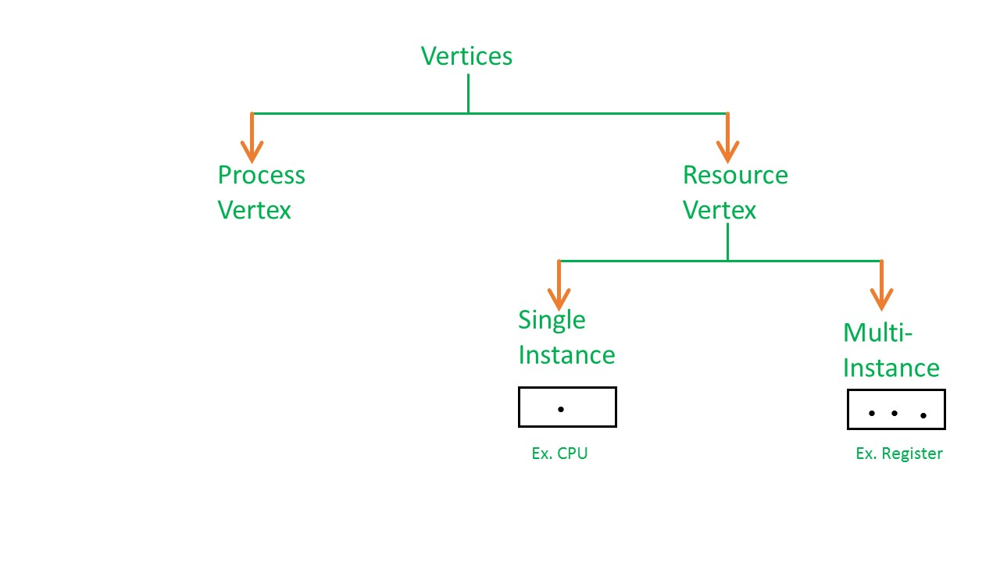
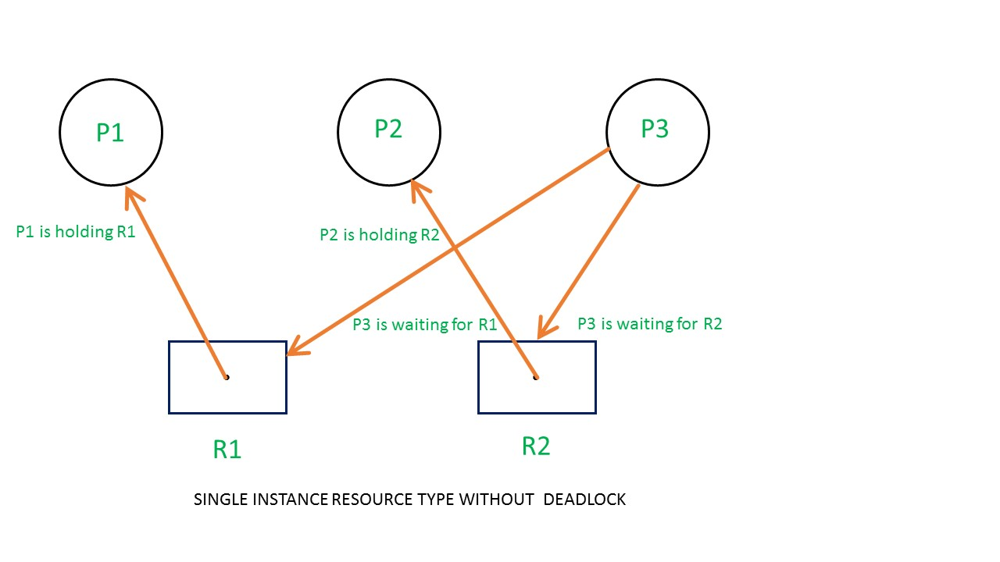
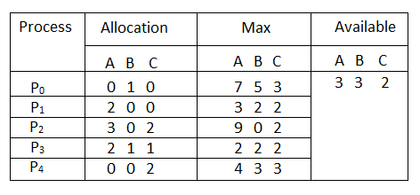
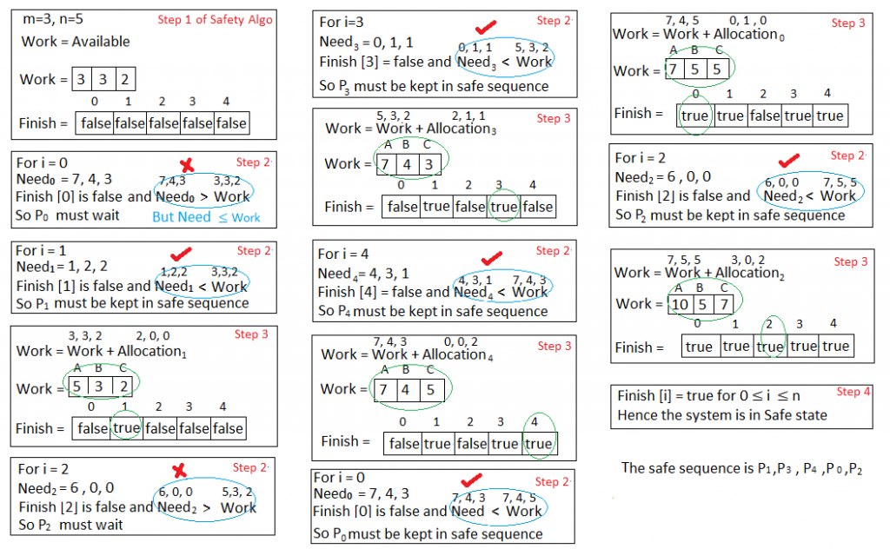

# CH8 Deadlock :skull: :lock:

[TOC]

In a multiprogramming environment, several threads may compete for a finite number of resources. A thread requests resources; if the resources are not available at that time, the thread enters a waiting state. Sometimes, a waiting thread can never again change state, because the resources it has requested are held by other waiting threads. This situation is called a deadlock.

The various synchronization tools such as `mutex lock`, `semaphores` are also system resources, and on contemporary computer system, they are the most common sources of deadlock.

A thread must request a resource before using it and must release the resource after using it. Obviously, the number of resources requested may not exceed the total number of resources available in the system.

**Example**

When 2 threads acquire 2 mutex in opposite order

```c
void* do_work_one(void* param){
    pthread_mutex_lock(&first_mutex);
    pthread_mutex_lock(&second_mutex);
    // TODO
    pthread_mutex_unlock(&second_mutex);
    pthread_mutex_unlock(&first_mutex);
    
    pthread_exit(0);
}
```

```c
void* do_work_two(void* param){
	pthread_mutex_lock(&second_mutex);
	pthread_mutex_lock(&first_mutex);
    // TODO
    pthread_mutex_unlock(&first_mutex);
    pthread_mutex_unlock(&second_mutex);
    
    pthread_exit(0);
}
```

Problem with handling deadlocks

1. Difficult to identity
2. Since it only occur under certain scheduling results

   > 當執行緒 1 執行互斥鎖 1 而恰好跳到執行緒 2 時，執行緒 2 執行互斥鎖 2 ，因為互斥鎖 1 已被執行緒 1 鎖住了，所以跳回執行緒 1 ，當執行緒 1 想要執行互斥鎖 2 時，又因為已被執行緒 2 鎖住，所以回到執行緒 2 , ...

## Livelock

Livelock is another form of liveness failure. It is similar to deadlock; both prevent 2 or more threads from proceeding, but the threads are unable to proceed for different reasons. Whereas daedlock occurs when every thread in a set is blocked waiting for an event that can be caused only by another thread in the set, **livelock occurs when a thread continuously attempts an action that fails**. 比方說與路人相向而行兩人同時向左或同時向右而無法前行

`pthread_mutex_trylock` attempts to acquire lock without blocking. Livelock typically occurs when threads retry failing operations at the same time. It thus can generally be avoided by having each thread retry the failing operating at random time. Livelock is less common than deadlock but nonetheless is a challenging issue in designing concurrent applications.

**Example of livelock**

```c
void* work_one(void* params){
    int done = 0;
  	while(!done){
        pthread_mutex_lock(&first_mutex);
        if(pthread_mutex_trylock(&second_mutex)){
            // TODO
            pthread_mutex_unlock(&second_mutex);
            pthread_mutex_unlock(&first_mutex);
            done = 1;
        }else{
            pthread_mutex_unlock(&first_mutex);
        }
    }
    pthred_exit(0);
}
```

```c
void* work_two(void* params){
    int done = 0;
    while(!done){
        pthread_mutex_lock(&second_mutex);
        if(pthread_mutex_trylock(&first_mutex)){
            // TODO
            pthread_mutex_unlock(&first_mutex);
            ptherad_mutex_unlock(&second_mutex);
            done = 1;
        }
    }
    pthread_exit(0);
}
```


## Characterization

Deadlock can arise if 4 conditions hold *simultaneously*

1. **mutual exclusion (Mutex)**: Only one thread at a time can use a resource
2. **hold and wait**: a thread holding at least one resource is waiting to acquire additional resources held by other threads
3. **no preemption**: a resource can be released only voluntarily by the thread holding it. A 無法搶走 B 的資源，除非 B 主動放棄
4. **circular wait**: there exists a set {p<sub>0</sub>, p<sub>1</sub>, ..., p<sub>n</sub>} of waiting threads s.t. p<sub>n</sub> is waiting for resource that is held by p<sub>n-1</sub> and p<sub>n</sub> is waiting for resource that held by p<sub>0</sub>

## Methods for Handling Deadlocks

1. Ensure that the system will *never* enter a deadlock state
   Deadlock prevention or deadlock avoidance

2. Allow system to enter a deadlock state and then recover

   Deadlock detection and deadlock recovery

3. Ignore the problem

   used by most OS, including UNIX, Linux, Windows XP

### Deadlock prevention

A set methods for ensuring at least **one of the four conditions cannot hold**

> 1. Mutual exclusion (Mutex): 嘗試取消互斥鎖 → 無法實現，因為有些東西是不可共享的，一定得用到互斥鎖，比如列表機 :printer:
>
> 2. Hold and wait: 嘗試在執行緒要求資源時，不要鎖住其他資源 
>    → Method 1: hold and no wait → 在執行緒執行前先將要使用的資源準備好
>    → Method 2: wait and no hold → 只有在該執行緒沒有其他資源時才給資源
>    → Disadvantage:
>
>    + Low resource utilization: some resource be allocated but unused for a long time
>    + Starvation possible: a thread needs several popular resources may have to wait infinitely
>
> 3. No preemption: 當某執行緒 A 已經擁有一些資源時，不可再請求其他資源
>
>    → Method1: 讓所有 A 擁有的資源都可以被搶奪
>
>    → Method2: Check the requested resource for following case
>
>    + if it is allocated to a wating thread for additional resources, preempt the resource from the waiting thread and allocate it to A
>    + if it is held by a thread not wating, A must wait. A's resources may be preempted, but only if another thread requests them
>
>    → Disadvantage: Only apply to resources whose state can be easily saved and restored (i.e., CPU, registers, memory). Cannot apply to resources such as mutex and semaphores, but deadlock :lock: occurs most commonly due to mutex and semaphores
>
> 4. Circular wait: impose (強加) a total ordering of all resource types
>    e.g., F(first_mutex) = 1, F(second_mutex) = 5
>
>    + Method1: 控制請求資源順序 each thread requests resources in an increasing order of enumeration.
>      + accept, if first_mutex → second_mutex
>      + reject, if second_mutex → first_mutex
>    + method2: 當有資源請求時釋放部分資源以避免產生迴圈 whenever a thread requests R<sub>j</sub> , it has releases any resources R<sub>i</sub> such that $F(R_i)>F(R_j)$ 

### Deadlock avoidance

Check if the admission of a request may lead to a deadlock (檢查是否有可能會發生 deadlock). i.e., Deadlock avoidance ensure that a system will never enter an unsafe state.

> + Requires the system has some additional a priori information
>+ The deadlock-avoidance algorithm dynamically examines the resource-allocation state. Ensure that there can never be a **circular-wait condition**
> + **Resource-allocation state** - Defined by the number of available and allocated resources, and the maximum demands of processes

#### Safe State & unsafe state

System is in safe state if there exists a safe execution sequence of all threads

> System is in **safe state** when
> $$
> \text{Avaliable}+\Sigma_{1\leq k \leq i}\text{Allocated}_k\geq\text{MaxNeed}_i
> $$
> **Unsafe state: **
>
> No safe sequence exists **may** lead to a deadlock (並不是一定會導致 deadlock，就只是有比較高機率)
>
> ---
>
> If a system is in safe state → no deadlocks.
>
> If a system is in unsafe state → possibility of deadlock.

#### Resource-allocation-graph algorithm

繪出 graph 不可以有有向環，當有向環出現時，代表有機會出現 deadlock，當沒有環出現時，則代表不會發生 deadlock





#### Banker's algorithm

Each thread must a priori claim maximum use. (在使用前就先宣告). When a thread requests a resource, it may have to wait. Even if the requested resources are available.

```
(1) Let Work and Finish be vectors of length ‘m’ and ‘n’ respectively.
	Initialize: Work = Available
	Finish[i] = false; for i=1, 2, 3, 4….n

(2) Find an i such that both
	(a) Finish[i] = false
	(b) Need_i <= Work
		if no such i exists goto step (4)

(3) Work = Work + Allocation[i]
	Finish[i] = true
	goto step (2)

(4) if Finish [i] = true for all i
	then the system is in a safe state
```

|      | Allocation<br />A B C | Need<br />A B C | Max<br />A B C | Available<br />A B C |
| ---- | --------------------- | --------------- | -------------- | -------------------- |
| P0   | 0 1 0                 | 7 4 3           | 7 5 3          | 2 3 0                |
| P1   | 3 0 2                 | 0 2 0           | 3 2 2          |                      |
| P2   | 3 0 1                 | 6 0 0           | 9 0 1          |                      |
| P3   | 2 1 1                 | 0 1 1           | 2 2 2          |                      |
| P4   | 0 0 2                 | 4 3 1           | 4 3 3          |                      |

```
計算 Need 公式：Max - allocation
------------------------------------------------
Work = (2, 3, 0)
選擇 P1 (0, 2, 0) <= (2, 3 ,0) Work += (3, 0, 2)
	Work == (5, 3, 2)
選擇 P3 (2, 1, 1) <= (5, 3, 2) Work += (2, 1, 1)
	Work == (7, 4, 3)
選擇 P4 (0, 0, 2) <= (7, 4, 3) Work += (0, 0, 2)
	Work == (7, 4, 5)
選擇 P0 (7, 4, 3) <= (7, 4, 5) Work += (0, 1, 0)
	Work == (7, 5, 5)
選擇 P2 (3, 0, 1) <= (7, 5, 5) Work += (3, 0, 2)
	Work == (10, 5, 7)
------------------------------------------------
安全的排程
P1→P3→P4→P0→P2
```

### Deadlock detection

> Allow system to enter deadlock state, and detect whether deadlocks occur. 如果偵測到 deadlock 就自動恢復
>
> + Detection algorithm
> + Recovery scheme
>
> **Example of Detection Algorithm**
>
> |      | Allocating<br />A B C | Request<br />A B C | Available<br />A B C |
> | ---- | --------------------- | ------------------ | -------------------- |
> | P0   | 0 1 0                 | 0 0 0              | 0 0 0                |
> | P1   | 2 0 0                 | 2 0 2              |                      |
> | P2   | 3 0 3                 | 0 0 0              |                      |
> | P3   | 2 1 1                 | 1 0 0              |                      |
> | P4   | 0 0 2                 | 0 0 2              |                      |

```
Work = (0, 0, 0)
p0 執行時
	(0, 0, 0) <= (0, 0, 0) safe work += (0, 1, 0)
	work == (0, 1, 0)
p2 執行時
	(0, 0, 0) <= (0, 1, 0) safe work += (3, 0, 3)
	work == (3, 1, 3)
p3 執行時
	(1, 0, 0) <= (3, 1, 3) safe work += (2, 1, 1)
	work == (5, 2, 4)
p1 執行時
	(2, 0, 2) <= (5, 2, 4) safe work += (2, 0, 0)
	work == (7, 2, 4)
p4 執行時
	(0, 0, 2) <= (7, 2, 4) safe work += (0, 0, 2)
	work == (7, 2, 6)
```

> Sequence <p0, p2, p3, p1, p4>

The **deadlock-detection algorithm** is very similar to the deadlock-avoidance algorithm, but **it uses the processes' current requests** rather than their maximum claim.

---

## More example

### Example of deadlock avoidance



*Need = Max - Allocation*



**Reference**

+ https://www.geeksforgeeks.org/resource-allocation-graph-rag-in-operating-system/

+ https://www.geeksforgeeks.org/bankers-algorithm-in-operating-system-2/

## Deadlock Detection Algorithm v.s. Deadlock Avoidance Algorithm

The deadlock-detection algorithm is very similar to the deadlock-avoidance algorithm, but it (deadlock-detection) uses the processes' **current requests** rather than their maximum claim.

In general, **deadlock avoidance is more expensive than deadlock detection**. 步步為營比起有錯再修正來的麻煩，因為deadlock 發生的機率真的很低

Deadlock avoidance must be executed for every request, and it restricts resource utilization, so it may degrade system performance.

