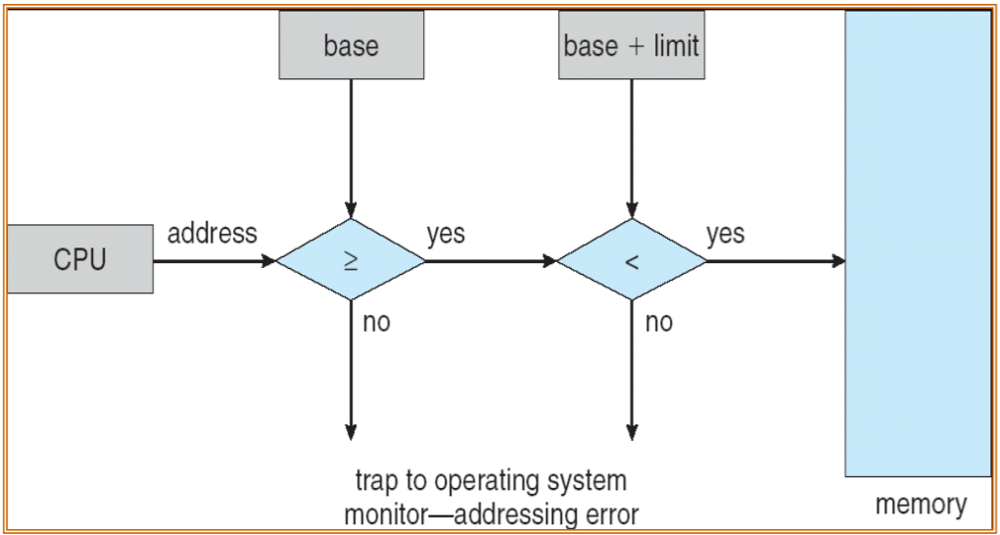
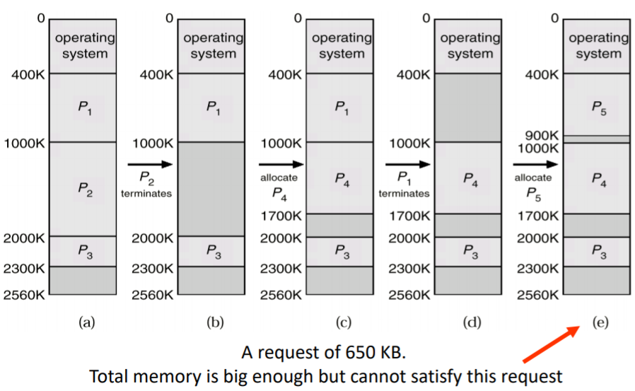
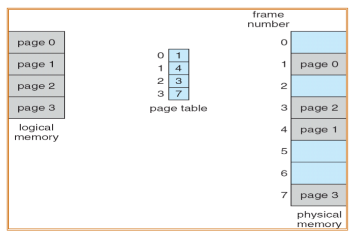
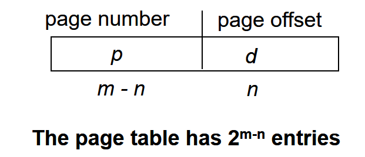
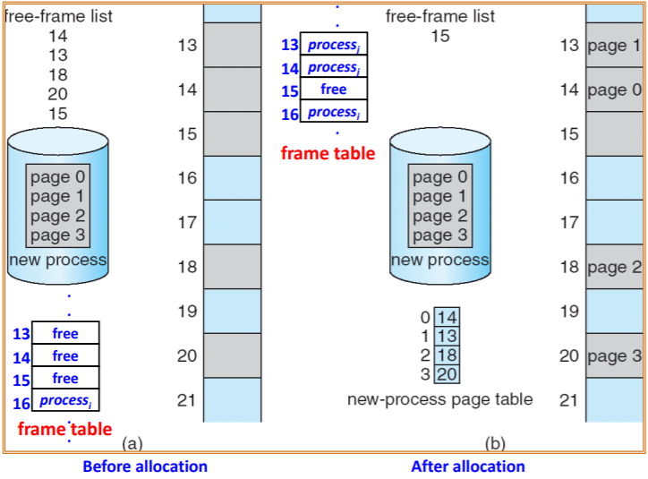
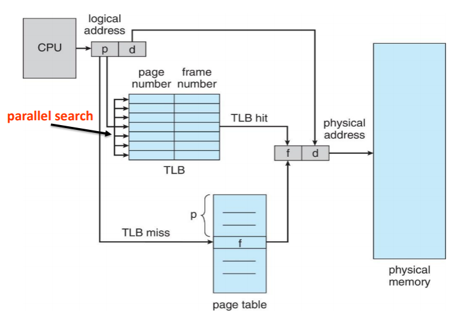
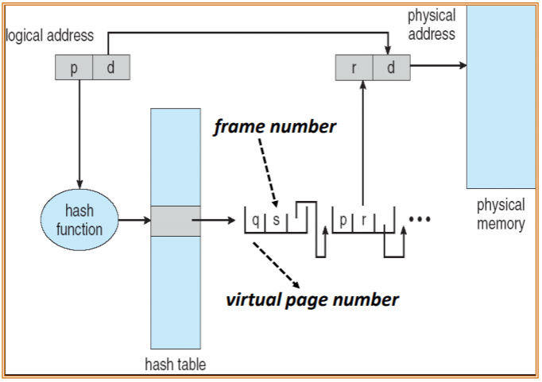
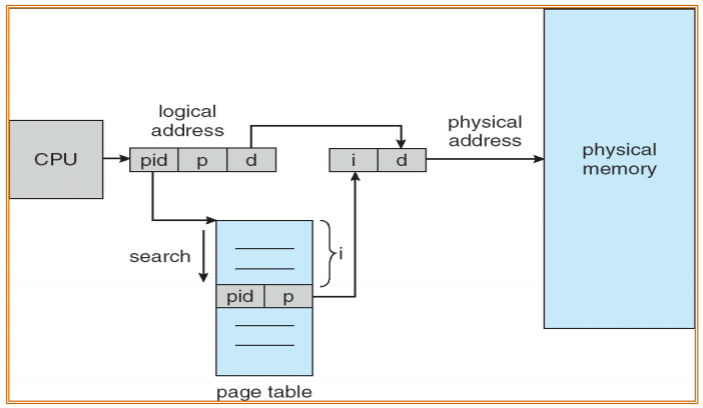

# Chapter 9: Main Memory

## Background

Main memory and registers are storage only CPU can access directly.

+ Access speed: main memory can take many cycles. Register access is done in one CPU clock (or less).

+ Protection of memory: protect OS from by user processes, as well as protect user processes from one another. (避免使用者程式去存取其他程式的記憶體位址)

  > We must protect the operating system from access by user processes, as well as protect user processes from one another. Protection of memory sapce is accomplished by having the CPU hardware compare every address generated in user mode with the registers.
  >
  > **How to protect and by whom?**
  >
  > 1. OS 不會介入 CPU 存取記憶體
  > 2. We can provide this protection by using two registers, usually a base and a limit.
  >    + Base register: hold the smallest legal physical memory address
  >    + Limit register: specify the size of range
  >    + 
  >    + These two registers can only be loaded by the OS. (Privileged instructions, see [CH1 dual-mode and multi-mode of operations](https://hackmd.io/19Osz5jKSQqIHk6Tl3OP2g))
  >    + 

**Question**: Programmers use variables, but memory controllers access memory by address. How to do?

**Solution**: address binding, a mapping from one address space to another

由於 OS 無法介入 CPU 存取記憶體因此發明一個硬體裝置 MMU，CPU 直接去存 MMU，但 MMU 又不夠快，所以再添加一個 Cache

### Address binding

Most systems allow a user process to reside in any part of the physical memory. Thus, although the address space of the computer may start at 00000, the first address of the user proess need not be 00000. A compiler typically binds these symbolic addresses to relocatable address. The linker or loader in turn binds the relocatable addresses to absolute addresses. Each binding is a mapping from one address space to another.

The binding of instructions and data to memory addresses can be done at any step along the way.

+ At compiler time: e.g., SIC computer. If the starting location changes, then it will be necesary to recompile this code.

+ At load time: e.g., SIC/XE computer. If the starting location changes, we need only reload the user code to incorporate this changed value.

+ At execution time: e.g., x86 computer. Most OS use this method.

### Logical v.s. physical address space

CPU → MMU(Memory manage unit) → Physical memory

+ logical address ─ generated by CPU; also referred to virtual address.
+ physical address ─ addresses seen by the memory unit.

Run-time mapping from virtual to physical addresses is performed by a hardware device called the MMU (**Memory-Management Unit**)

### Dynamic Loading

Dynamic loading: A routine is not loaded until it is called. Better memory-space utilization

+ unused routine is never loaded
+ useful when large amounts of code are needed to handle infrequently occurring access

### Dynamic Linking

**Static liking**

System libraries and program code combined into the binary program image before execution. 浪費儲存空間和記憶體使用

**Dynamic linking**

Liking postponed until execution time. 減少儲存空間和記憶體使用

Such libraries are called dynamically linked library (DLLs 動態連結程式庫) Windows: .dll Unix: .so

虛擬記憶體可以實現不同程式共用一份 library

Dynamically linked libraries (DLLs)are system libraries that are linked to user programs when the programs when the programs are run. Unlike dynamic loading, dynamic linking and shared libraries generally require help from the OS. If the processes in memory are protected from one another, then the OS is the only entity that can check to see whether the needed routine is in another process's memory space or that can allow multiple processes to access the same memory addresses.

## Contiguous Memory Allocation

*contiguous = continuous*

The memory is usually divided into two partitions: one for the OS and one for the user processes. Many operating systems (including Linux and Windows) place the operating system in high memory.

Contiguous memory allocation: each process is contained a single contiguous of memory.

### Memory Protection by contiguous memory

Protect user processes from each, and changing OS code and data.

Solution: 

1. CPU register (base + length) 
   aka. (relocatable reg + limit reg)
2. OS loaded two registers with the correct values **(stored in PCB) when context switching**
3. MMU maps logical address dynamically to physical address.

### Dynamic Storage-Allocation Problem

>  How to satisfy a request of size *n* from a list of free holes?

1. First-fit: Allocate the first hole that is big enough. 找第一個大小合適的洞
1. Best-fit: Allocate the smallest hole that is big enough. 所有合適的洞中最小的
3. Worst-fit: Allocate the largest hole. 找最大的洞

第三種方法最差，第一、二種方法較好，其中第一種又比第二種快，因為第二種要把整個記憶體掃一遍

## Fragmentation

+ External fragmentation: 明明記憶體的空間夠，但剩餘的記憶體並不連續，因此無法將 process 塞進去，常見於 first-fit 和 best-fit. We could have a block of free (or wasted memory) between every two processes. 
+ Internal: partition 太大而沒有完整的利用 partition 內的空間

### External fragmentation (外部破碎):broken_heart:

> Total memory space exists to satisfy a request, but it is not contiguous
> 
> **50-percent rule:** for *first-fit*, given N allocated blocks, another 0.5N will be lost to fragmentation. **1/3 of memory may be unusable!**

Solutions to reduce external fragmentation:

1. sol1: compaction
   
   > Shuffle memory contents to place all free memory together in one large block. 重排記憶體

2. sol2: non-contiguous memory allocation (主流)
   
   > Allow the physical address of the processes to be noncontiguous. e.g., **paging**, the most common memory-management technique for computer systems.

### Internal fragmentation (內部破碎) :broken_heart:

Usually, physical memory is broken into fixed-sized blocks. Memory is allocated to processes in unit of block sizes. 

Allocated memory may be slightly larger than requested memory. **Paging also have internal fragmentations** (paging 雖然能解決 external fragmentation的問題，但也會有internal fragmentation的問題)

> e.g.
> 
> + A block = 1024 bytes
> + Request memory = 1000 bytes
> + Allocated memory = 1block = 1024 bytes
> + Internal fragmentation = 24 bytes

## Paging :book:

Paging, a memory-management scheme that permits a process's physical address space to be non-contiguous. Paging **avoids external fragmentation and the associated need for compaction**, two problems that plague contiguous memory allocation.

Implemented through cooperation **OS** and **hardware** (MMU, etc)​​

+ Hardware: divides physical memory into **fixed-size block called frame**
+ OS: sets up **a page table** (to translate logical to physical address) **for each process**

The basic method for implementing paging involves breaking **physical** memory into fixed-sized blocks called **frames** and breaking **logical** memory into blocks of the same size called **pages**.

### Address Translation Scheme

Address generated by CPU is divided into:

+ page number (p): used as index into a page table
+ page offset (d): combined with base address to define the physical memory address that is sent to the memory unit
+ logical address: page number + page offset
+ logical address space = $2^m$
+ page size = $2^n$

### Page Size Selection

+ No external fragmentation

+ Internal fragmentation: 1/2 pages per process in average

+ Small page size => more table entries => waste memory space

+ Trend: page sizes have grown over time (windows 10 supports 4KB and 2MB page size)

### Frame Table

In addition to page table, OS maintains a **frame table** to keep track of all frames

+ An entry for each physical frame
+ Whether frame is free or allocated
+ If allocated, to which page of which process

### Per-Process Page Table

Paging provides a clear separation between the user's view of memory and the actual physical memory. User program views memory as **one single** space, in fact, the single space map to **non-contiguous** physical frames. The translation is down by the address translation hardware by consulting the page table.

Page table 存在實體記憶體中，PCB 內會有指向 Page table 的指標

Besides, **hardware introduces two registers**

1. page-table base register (RTBR): 指向現在執行的程式的 page table 位址
2. page-table length register (RTLR): 該 page table 的長度

**When context switch**, **PTBR** and **PTLR** are changed to point to the current process's page table

**Performance**

每次執行程式時，要**先從 page table 取得實際位址，再去實際記憶體存取，一共要跑兩次，太久了，所以 TLB(translation lock-aside buffers) 誕生啦**

### TLB 

Translation look-aside buffers, the cache of page table, is an associative, high-speed memory.

1. A special, small, fast-lookup hardware cache (32~1024 entries)
2. consists of 2 parts
   + key: virtual page number
   + value: physical frame number
3. When TLB miss
   + Get frame number from **page table** in memory
   + Add the information about the PTE into the TLB
   + When TLB is full, select a victim entry for replacement
4. Another choice: add **address-space identifiers** (ASID).
   + address-space identifiers: uniquely identifies each process
   + If the ASIDs do not match, the attempt is treated as a TLB miss.
   + If the TLB does not support separate ASIDs, then every time a new page table is selected (e.g., with each context switch), the TLB must be flushed. (每個 process 有自己的 page table，TBL 只存 page number 對應 frame number，所以在沒有 ASID 的幫忙下兩個 process 有可能會有同一個 page number)
   + ASIDs allow TLB contain entries for several processes simultaneously

### Effective Access Time

**Hit ratio**: percentage of times that a page number is found in TLB

Assume: memory access time = 10ns, TLB miss access time = 20ns, TLB hit, access time = 10ns

若 hit ratio = 80% 會浪費 20% 的效能

但實際上一般來說因為程式的指令都很近指要 miss 一次後加入 cache，就不太會在 miss，hit ratio 可以達到 99%，只會浪費 1% 的效能

### Memory Protection

By associating protection bit with each frame protection bits

+ read-write, read-only, or execute-only
+ **valid-invalid**
  + Valid: the associated page is in the process' logical address space => *address translation*
  + Invalid: the page is not in the process's logical address space => *trap*
+ These protection bits are kept to each entry in page table
+ valid-invalid bits 只能精準到 frame 不能定位到 frame 裡面的 address

In fact, most processes only uses a small address space, thus, few valid PTEs but many invalid PTEs in page tables. => wastes memory space

Sol. A page-table length register (PTLR)

+ indicate the size of the page table
+ if logical address > PTLR => trap

> Q: RTLP 的用途，若沒有 RTLP 會怎麼樣，若有，會怎麼樣？
>
> A: 有 RTLP 的幫助可以不用透過 valid - invalid bit 來偵測該程式是否存取超過其應有的範圍

### Shared Pages :couple:

Another advantage of paging is the possibility of sharing common code.

Shared code must be **reentrant code** (or pure code). Reentrant code: it never changes during execution (read-only code). Thus, two or more processes can execute the same code at the same time.

Only one copy of the shared code is kept in physical memory.

> E.g., 40 users used *libc* in the same time and *libc* is 2 MB. By shared page, only 2MB, instead of 80MB, memory is required. 
> 
> **NOTE: Data pages are not shared**

## Structure of the Page Table

**Motivations**: Modern computer supports a large logical address space. The page table becomes excessively large 

page table 需要靠記憶體儲存，page table 儲存時也會造成 external fragmentation, 若為了解這個問題而改用不連續的儲存方式，也行不通，因為我們希望 page table 的位址是連續的

1. Hierarchical Paging (aka.  forward-mapped page table)
   利用另一個 page table 來存放 p age table
   e.g. 64-bit UltraSPARC needs **7 levels** of paging

2. Hashed Page Tables
   The virtual page number is hashed into a page table. Virtual page numbers are compared on this chain to search for a match (避免 collision).
   

3. Inverted Page Tables (IPT)
   先前的方法需要每個程式保留一份 page table 這會浪費很多記憶體
   Use a system wide PT instead of per-process PTs. One entry for each page frame of memory. Each entry consists of:
   
   + information about the process that owns that page (pid)
   
   + virtual address of the page stored in that frame (virtual page number)
   
   + only **one** inverted page table is in the system
   
   + pros: 減少記憶體
   
   + cons: 查尋時要 linear search 整個 IPT, solution: use hash table
   
   + IPT 很難實作 shared memory
   
     With standard paging, each process has its own page table, which allows method cannot be used with inverted page tables; because there is only one virtual page entry for every physical page, one physical page cannot have two (or more) shared virtual addresses. Therefore, with inverted page tables, only one mapping of a virtual address to the shared physical address may occur at any given time.
   
   

## Swapping

Process instructions and the data they operate on must be in memory to be executed. However, a process, or a portion of a process, can be swapped temporarily out of memory to a baking store and then brought back into memory for continued execution.

### Standard Swapping

Standard swapping involves moving entire processes between main memory and a backing store.

**Advantages**

The advantage of standard swapping is that it allows physical memory to be oversubscribed, so that the system can accommodate more processes than there is actual physical memory to store them.

**Backing store**

For swap space, usually a fast disk partition -- separate from the file system, so that its use is as fast as possible. Good candidates for swapping out: idle or mostly idle processes.

Now, standard swapping is not used in current OS (i.e., Linux and Windows). Due to too much swapping time.

### Swapping with Paging

Standard swapping is not used in current OS because the amount of time required to move entire processes between memory and the backing store is prohibitive(禁止的).

Most systems, including Linux and Windows, now use a variation OS swapping in which page of a process, rather than an entire process, can be swapped.

+ A **page out** operating moves a page from memory to the backing store
+ **Page in** moves a page from backing store to memory.

### Swapping on Mobile Systems

Most OS for PCs and servers support swapping pages. In contrast, mobile systems typically do not support sapping in any form. Mobile devices generally use **flash memory** rather than more spacious hard disks for nonvolatile storage. flash memory 寫入次數有限且 throughput 太小

Instead of using swapping, when free memory falls below a certain threshold, iOS asks applications to voluntarily relinquish allocated memory. Read-only data are removed from main memory and later reloaded from flash memory if necessary. Data that have been modified are never removed.

Android adopts a strategy similar to that used by iOS. It may terminate a process if insufficient free memory is available. However, before terminating a process, Android writes its application state to **flash memory** so that it can be quickly restarted.
