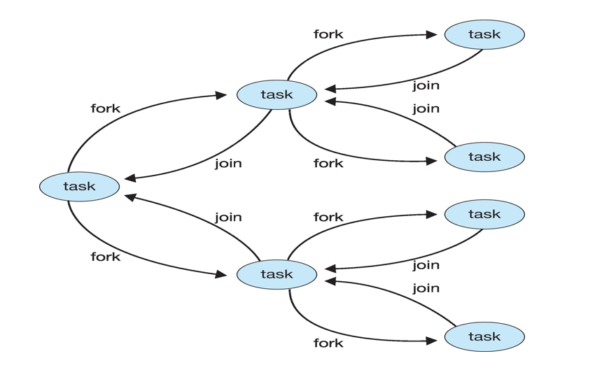

## Implicit Threading

Design such a multi-threading application is not easy

Solutions: implicit threading

+ Creation and management of threads are done by **compilers** and **run-time libraries**, rather than programmers.

### Thread Pools

+ Consider a web server service each request with a separate thread
  
  + Creating and destroy thread dynamically - time consuming
  
  + Unlimited number of threads - exhaust system resource

+ Sol: Thread pools
  
  + Create a number of threads in a pool to wait work (節省創建時間)
  
  + Receiving a request → awaken a thread from the pool  → pass it the request to service
  
  + Once the thread completes its service → return to the pool
  
  + If not available thread → server waits until one becomes free (可以避免被大量query 而塞爆記憶體)

### Fork join

+ General algorithm for fork-join strategy
  
  ```java
  Task(problem)
      if problem is samll enough
          solve the problem directly
      else
          subtask1 = fork(new Task(subset of problem))
          subtask2 = fork(new Task(subset of problem))
  
          result1 = join(subtask1)
          result2 = join(subtask2)
  
          return combined results
  
  // 這裡的 fork join 不是指創立新的 process
  // 而是一種 implicit threading 的方法
  ```

+ Tasks are constructed, instead of threads, during fork stage

+ Implicit for-join model
  
  + Tasks are constructed, instead of threads, during fork stage.

+ A library
  
  + Determines the actual number of threads to create
  
  + Create the threads, manages the threads, and assign tasks threads

+ Useful for recursive divide-and-conquer algorithm

### OpenMP

+ Consists of compiler directives and APIs for C, C++, or FORTRAN

+ Provides support for parallel programming in shared-memory environments

+ Define **parallel regions** - Blocks of code that can run in parallel

+ Programmer only insert **compiler directives** to identify parallel regions
  
  + These directives caused the OpenMP library to executed the region in parallel

```c
#include<omp.h>
#include<stdio.h>
int main(){
    /*sequential code...*/
    #pragma omp parallel{
        printf("I am a parallel region.");
    }
   /*sequential code...*/
}
```

### Grand Central Dispatch (GCD)

+ Apple technology for Mac OS X and IOS

+ Consist of Language Extensions to C and C++, API, and run-time library

+ Allow identification of section of codes (tasks) to run in parallel
  
  + By defining "block"
  
  + Like OpenMP

+ A "blocks"
  
  + Sytax: `^{...}`
  
  + A block can be run parallel

+ Example: `^{printf("I am a block");}`

### Intel Thread Building Blocks (TBB)

+ Template library for designing parallel C++ programs

+ TODO

## Threading issues

### Semantics of fork() and exec()

+ fork() in a multi-thread application?
  
  + if one thread calls fork()
    
    + Duplicate all threads or duplicate only the thread that invoked fork()
  
  + Some UNIX system supports two versions of fork()

+ How about exec()?
  
  + If a thread invokes the exec() system call
  
  + **Replace the entire process - including all threads**
    
    + Threads share he code section

### Signal Handling

+ signals are **used in UNIX systems** to notify a process that a particular event has occurred

+ Two types of signals
  
  + Synchronous signals
    
    + Delivered to the **same process** that causes the signal
    
    + e.g. illegal memory access, divide by zero...
  
  + Asynchronous signals
    
    + Generated by external events
    
    + e.g. Ctrl-C to terminate a process, timer expires...

+ All signals follow the same pattern
  
  1. Signal is generated by a particular event
  
  2. Signal is delivered to a process
  
  3. Signal is handled by a signal handler

+ Each signal is handled by one of two handlers
  
  + A **default signal handler** in the kernel.
    預設會終止程式或忽略不處理

+ In single-threaded programs
  
  + Signals are delivered to a process
  
  + 處理signal沒啥問題

+ In a multi-threaded programs
  
  1. Deliver the signal to the thread to which the signal applies. e.g. synchronous signal (誰除以零就把訊號送給誰)
  
  2. Deliver the signal to every thread in the process. e.g. a Ctrl-C asynchronous signal
  
  3. Deliver the signal to certain threads in the process. e.g. `pthread_kill`. A thread can specify which signals to accept and which signals to block.

### Fork-join Parallelism



利用 fork 產生一個 task。比如要加總 50 個數字，可以用兩個 task 一個算前 25 個，另一個算後 50 個，最後再 join 起來

## Thread Cancellation

Two approaches for thread cancellation

+ Target thread: the thread to be cancelled

+ Asynchronous cancellation
  + Terminates the target thread immediately
  + May have problems in resource reclaim
    + 因為某 thread 在修改變數或檔案時如果被終止，會導致變數的值跑掉
+ Deferred cancellation
  + The target periodically check if it should terminate (週期性的檢查有沒有要結束執行緒)
  + Allow the target thread to terminate itself in a safe point, called **cancellation point**

## Thread-local storage

Although threads belonging to the same process share the data. **Solution: Thread-local Storage (LTS)**

LTS: Allows each thread to have its own copy of data.

+ Different from local variables
  + Local variables visible only during the closing function
  + TLS visible across function invocations

+ Similar to static data

## Linux Thread

+ Linux refers to them as tasks rather than threads

+ Thread creation is done through **clone()** system call

+ **clone()** allows how much sharing between parent and child tasks

–CLONE_FS: share the same file-system information 

–CLONE_VM: share the same memory space

–CLONE_SIGHAND: share the same signal handler

–CLONE_FILES: share the same set of open files

All flag are set → thread

All flag are not set → process